# PrepForge Complete System Architecture

**A Comprehensive Guide to the PrepForge/PrepWiser Interview Platform Architecture, Models, Workflows, and UML Diagrams**

---

## Table of Contents

1. [System Overview](#system-overview)
2. [High-Level Architecture](#high-level-architecture)
3. [Layered Architecture](#layered-architecture)
4. [Component Architecture](#component-architecture)
5. [UML Class Diagrams](#uml-class-diagrams)
6. [UML Sequence Diagrams](#uml-sequence-diagrams)
7. [UML State Machine Diagrams](#uml-state-machine-diagrams)
8. [Data Models and ER Diagrams](#data-models-and-er-diagrams)
9. [Workflow Diagrams](#workflow-diagrams)
10. [Real-Time Communication Architecture](#real-time-communication-architecture)
11. [API and Data Flow Contracts](#api-and-data-flow-contracts)
12. [Deployment Architecture](#deployment-architecture)

---

## 1. System Overview

PrepForge is an AI-powered interview simulation and skill assessment platform that helps candidates prepare for technical and behavioral interviews through adaptive question generation, rule-based evaluation, and personalized learning path recommendations.

### Core Value Propositions

1. **Explainable AI**: Transparent rule-based scoring instead of black-box models
2. **Semantic Intelligence**: Resume parsing and skill-gap detection across job descriptions
3. **Adaptive Learning**: Dynamic difficulty adjustment and follow-up questions based on performance
4. **Real-Time Interaction**: WebSocket-driven live interview sessions with instant feedback
5. **Longitudinal Tracking**: Progress monitoring across multiple interview attempts

### System Context Diagram

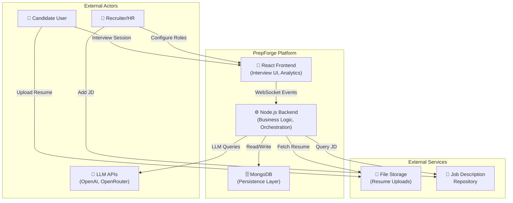

---

## 2. High-Level Architecture

### System Architecture Overview

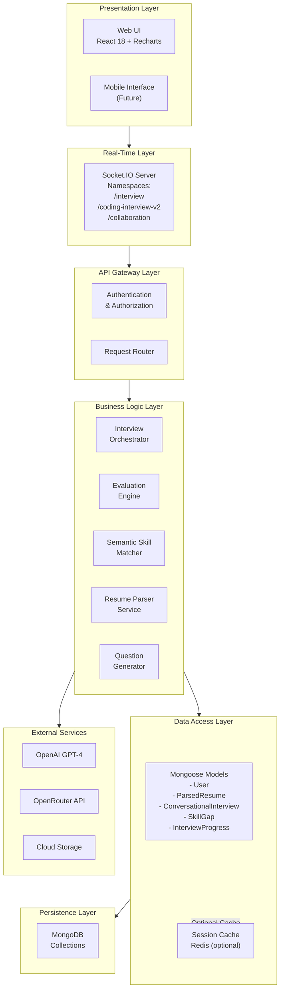

---

## 3. Layered Architecture

### Detailed Layer Responsibilities

#### 3.1 Presentation Layer

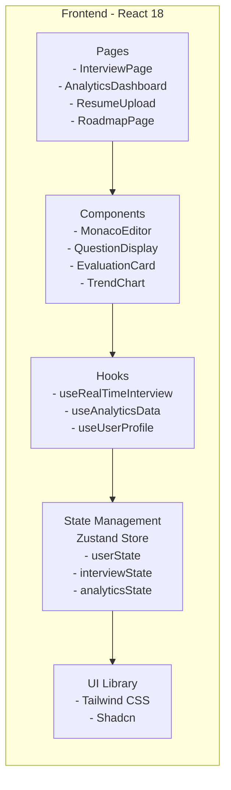

#### 3.2 Real-Time Communication Layer

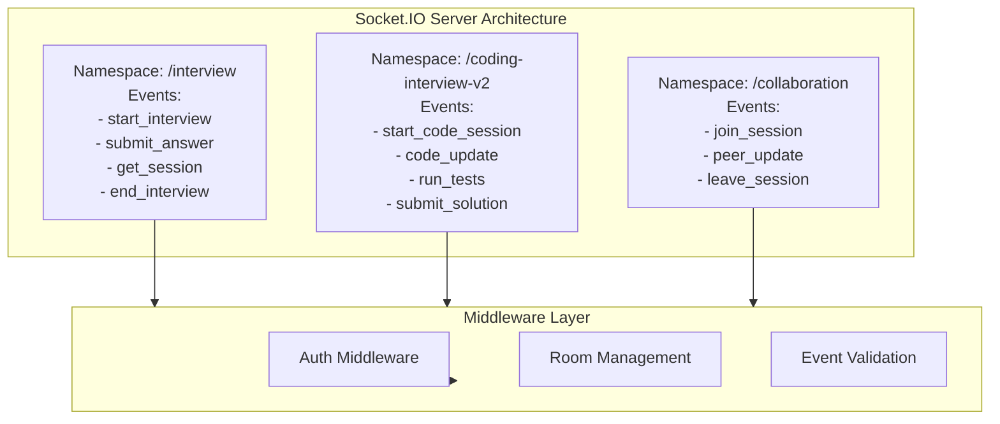

#### 3.3 Business Logic Layer

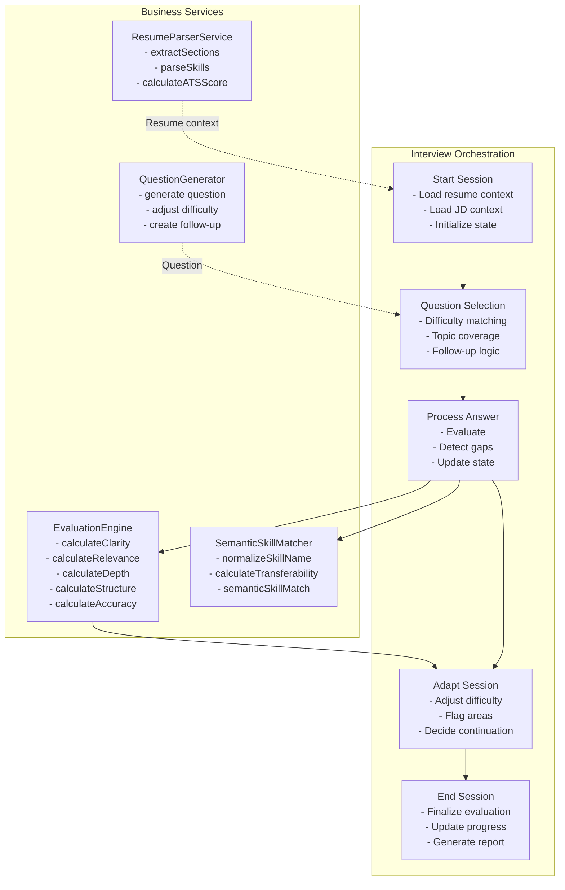

#### 3.4 Data Access Layer

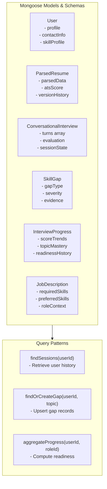

#### 3.5 Persistence Layer

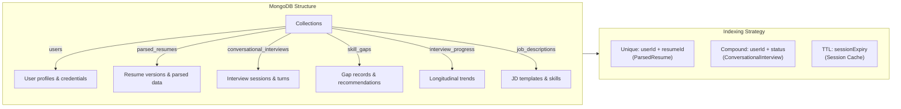

---

## 4. Component Architecture

### Frontend Component Hierarchy

```mermaid
graph TD
    subgraph APP["App Root"]
        LAYOUT["Layout Component<br/>- Navigation<br/>- Sidebar<br/>- Main Content"]
    end

    subgraph PAGES["Page Components"]
        HOME["HomePage<br/>- Dashboard summary<br/>- Quick links"]
        INTERVIEW["InterviewPage<br/>- Q&A interface<br/>- Timer<br/>- Submission"]
        ANALYTICS["AnalyticsDashboard<br/>- Charts & trends<br/>- Progress cards<br/>- Recommendations"]
        UPLOAD["ResumeUploadPage<br/>- File input<br/>- Preview<br/>- Parsing status"]
        ROADMAP["LearningRoadmap<br/>- Gap recommendations<br/>- Learning paths<br/>- Resource links"]
    end

    subgraph COMPONENTS["Shared Components"]
        EDITOR["MonacoEditor<br/>- Code highlighting<br/>- Syntax validation"]
        CARDS["EvaluationCard<br/>- Score display<br/>- Metric breakdown<br/>- Feedback text"]
        CHARTS["TrendChart<br/>- Line/Area charts<br/>- Radar charts<br/>- Bar charts"]
        FEEDBACK["FeedbackDisplay<br/>- Gap explanations<br/>- Actionable tips"]
    end

    subgraph HOOKS["Custom Hooks"]
        HOOK1["useRealTimeInterview<br/>- WebSocket connection<br/>- Event handling<br/>- State sync"]
        HOOK2["useAnalyticsData<br/>- Fetch trends<br/>- Compute aggregates"]
        HOOK3["useUserProfile<br/>- Load user data<br/>- Handle auth"]
    end

    subgraph STATE["State Management"]
        ZUSTAND["Zustand Store<br/>- userSlice<br/>- interviewSlice<br/>- analyticsSlice"]
    end

    APP --> LAYOUT
    LAYOUT --> PAGES
    PAGES --> COMPONENTS
    COMPONENTS --> HOOKS
    HOOKS --> STATE
```

### Backend Service Architecture

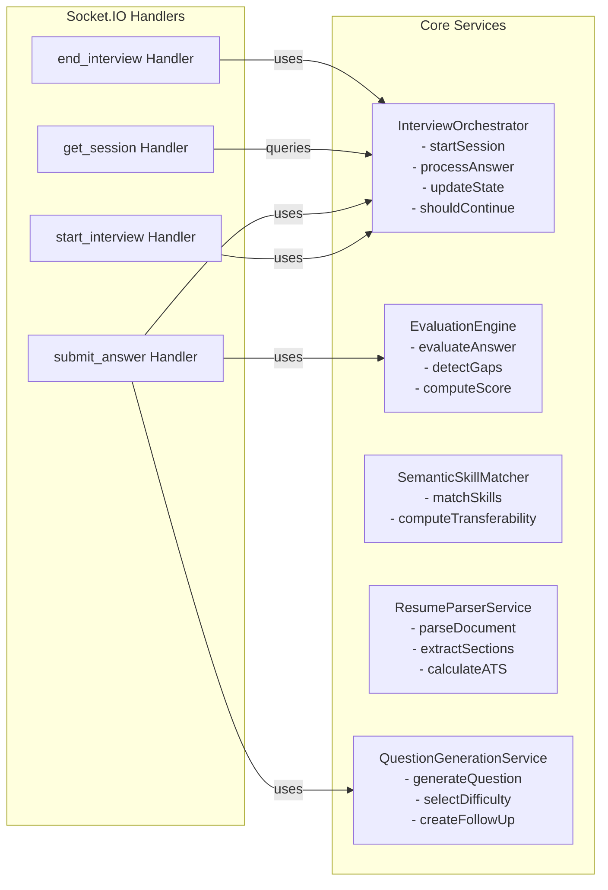

---

## 5. UML Class Diagrams

### 5.1 Core Domain Models

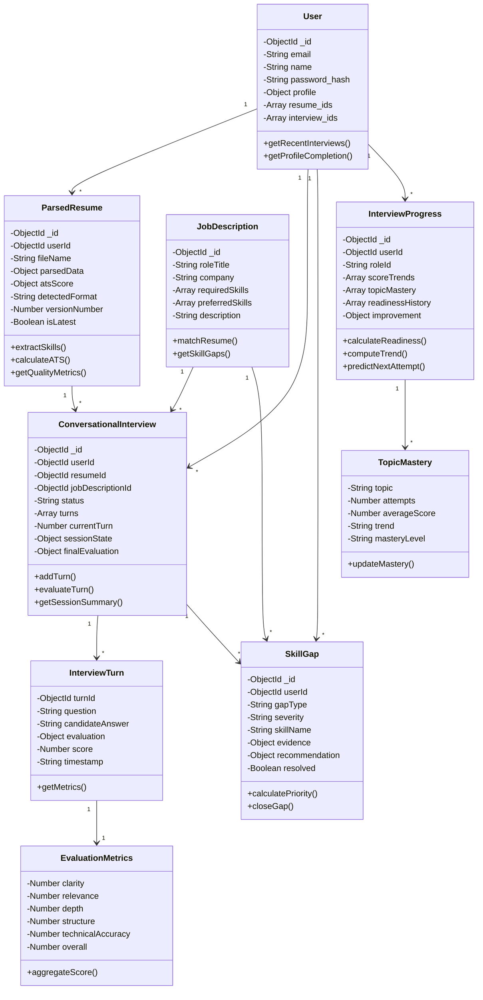

### 5.2 Service and Utility Classes

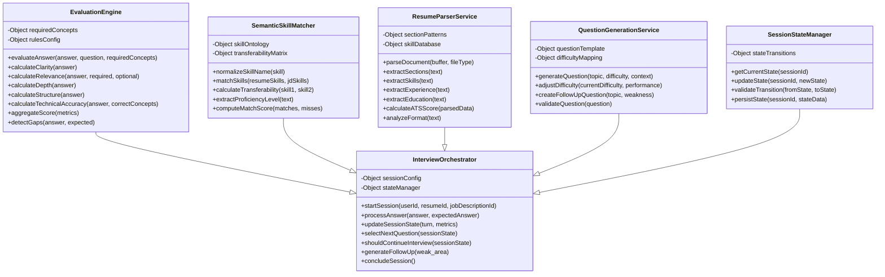

---

## 6. UML Sequence Diagrams

### 6.1 Resume Upload and Parsing Flow

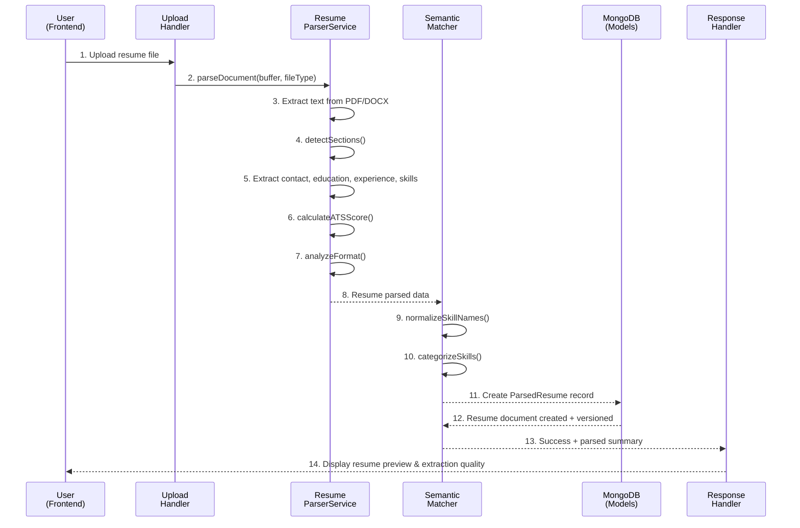

### 6.2 Interview Session Workflow

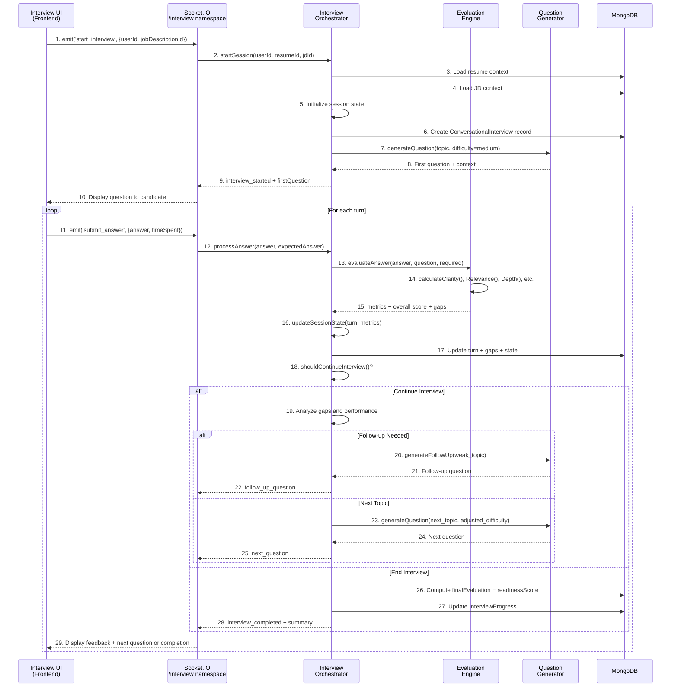

### 6.3 Skill Gap Detection and Recommendation Flow

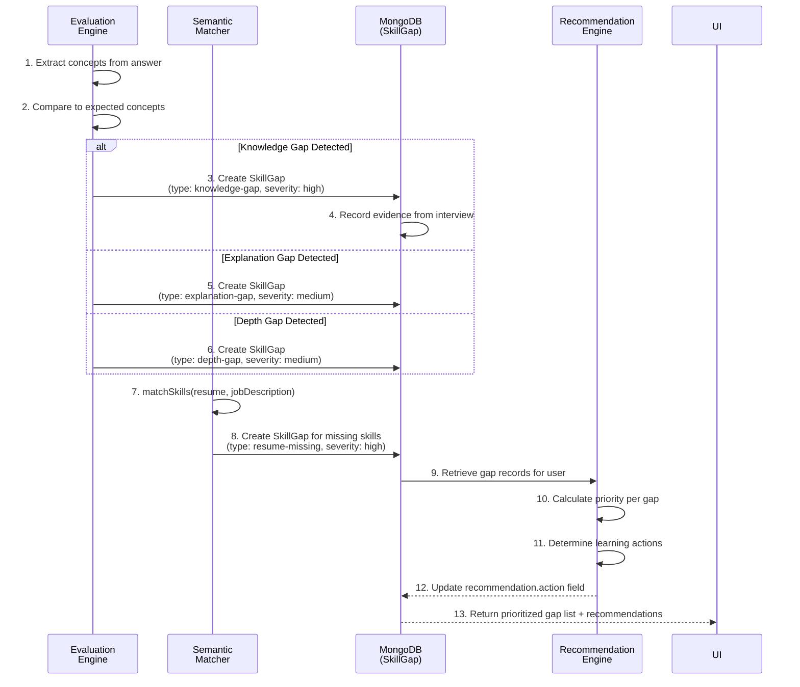

### 6.4 Analytics and Progress Aggregation

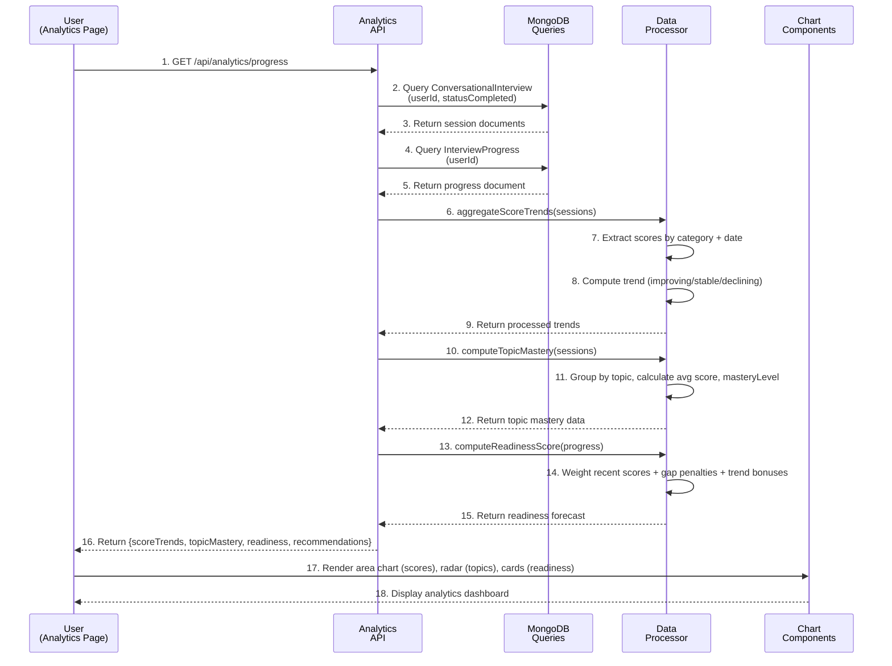

---

## 7. UML State Machine Diagrams

### 7.1 Interview Session Lifecycle

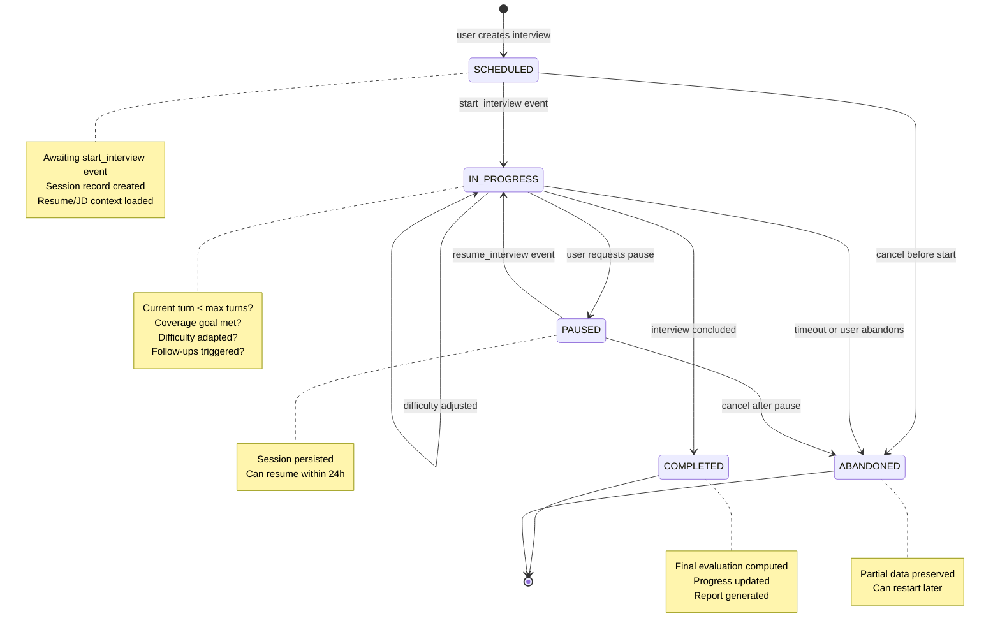

### 7.2 Skill Gap Resolution State Machine

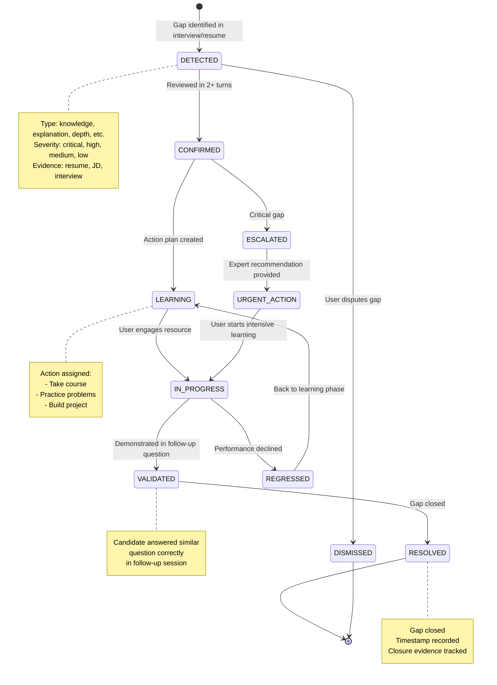

### 7.3 Adaptive Difficulty State Machine

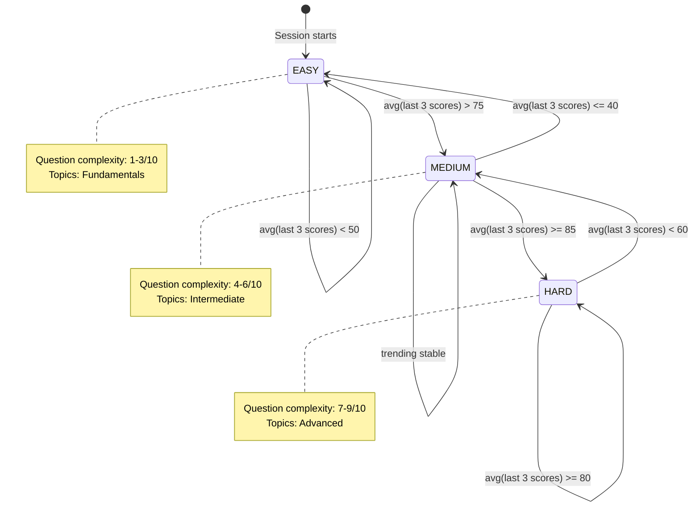

---

## 8. Data Models and ER Diagrams

### 8.1 Complete Entity-Relationship Diagram

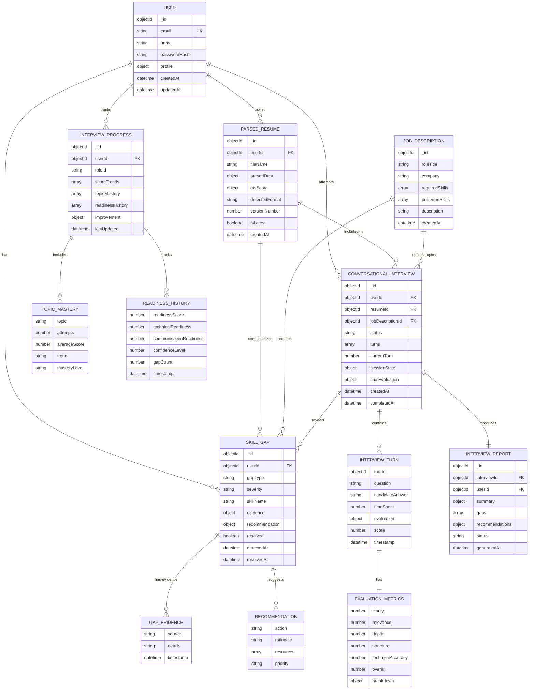

### 8.2 Schema Field Mappings

```mermaid
graph TB
    subgraph USER_SCHEMA["User Schema"]
        U1["_id: ObjectId"]
        U2["email: String (unique)"]
        U3["name: String"]
        U4["passwordHash: String"]
        U5["profile: Object<br/>{skills, experience, target_roles}"]
        U6["createdAt: DateTime"]
    end

    subgraph RESUME_SCHEMA["ParsedResume Schema"]
        R1["_id: ObjectId"]
        R2["userId: ObjectId (ref)"]
        R3["fileName: String"]
        R4["parsedData: Object<br/>{contact, education, experience, skills}"]
        R5["atsScore: Object<br/>{overall, componentScores}"]
        R6["detectedFormat: String"]
        R7["versionNumber: Number"]
        R8["isLatest: Boolean"]
    end

    subgraph INTERVIEW_SCHEMA["ConversationalInterview Schema"]
        I1["_id: ObjectId"]
        I2["userId: ObjectId (ref)"]
        I3["resumeId: ObjectId (ref)"]
        I4["jobDescriptionId: ObjectId (ref)"]
        I5["status: Enum<br/>{scheduled, in_progress, completed, abandoned}"]
        I6["turns: Array<InterviewTurn>"]
        I7["currentTurn: Number"]
        I8["sessionState: Object<br/>{topicsCovered, difficultyLevel, strugglingAreas}"]
        I9["finalEvaluation: Object<br/>{categoryScores, readinessScore}"]
    end

    subgraph GAP_SCHEMA["SkillGap Schema"]
        G1["_id: ObjectId"]
        G2["userId: ObjectId (ref)"]
        G3["gapType: Enum<br/>{knowledge, explanation, depth, application, resume-missing, interview-missing}"]
        G4["severity: Enum<br/>{critical, high, medium, low}"]
        G5["skillName: String"]
        G6["evidence: Object<br/>{fromResume, fromJD, fromInterview}"]
        G7["recommendation: Object<br/>{action, rationale, resources}"]
        G8["resolved: Boolean"]
    end

    subgraph PROGRESS_SCHEMA["InterviewProgress Schema"]
        P1["_id: ObjectId"]
        P2["userId: ObjectId (ref)"]
        P3["roleId: String"]
        P4["scoreTrends: Array<br/>{category, scores[], dates[]}"]
        P5["topicMastery: Array<br/>{topic, attempts, avg_score, trend}"]
        P6["readinessHistory: Array<br/>{score, factors, date}"]
        P7["improvement: Object<br/>{overall_improvement, trend}"]
    end

    USER_SCHEMA --> RESUME_SCHEMA
    RESUME_SCHEMA --> INTERVIEW_SCHEMA
    INTERVIEW_SCHEMA --> GAP_SCHEMA
    USER_SCHEMA --> PROGRESS_SCHEMA
```

---

## 9. Workflow Diagrams

### 9.1 End-to-End Candidate Journey

```mermaid
graph TB
    subgraph ONBOARDING["Onboarding Phase"]
        SIGNUP["Sign up / Login<br/>- Email + password"]
        PROFILE["Complete profile<br/>- Name, target roles<br/>- Experience level"]
    end

    subgraph PREPARATION["Preparation Phase"]
        UPLOAD["Upload resume<br/>- PDF/DOCX support"]
        PARSE["Resume parsed<br/>- Sections detected<br/>- Skills extracted<br/>- ATS scored"]
        PREVIEW["Preview parsed data<br/>- Correct mistakes<br/>- Add missing skills"]
        SELECT_JD["Select target role<br/>- Browse JD repository<br/>- Or paste custom JD"]
    end

    subgraph INTERVIEW["Interview Execution"]
        START_INT["Start interview session<br/>- Difficulty: medium<br/>- Duration: 15-30 min"]
        ANSWER["Answer questions<br/>- Speak/type responses<br/>- Time tracking"]
        FEEDBACK["Receive instant feedback<br/>- Metric breakdown<br/>- Gap explanations"]
        ADAPT["Adaptive follow-ups<br/>- Weak area probes<br/>- Difficulty adjustments"]
        COMPLETE["Session completed<br/>- Score calculated<br/>- Report generated"]
    end

    subgraph ANALYSIS["Analysis & Insights"]
        VIEW_REPORT["View detailed report<br/>- Performance summary<br/>- Gap breakdown<br/>- Readiness score"]
        TRACK_PROGRESS["Track longitudinal progress<br/>- Trend charts<br/>- Topic mastery<br/>- Improvement metrics"]
        IDENTIFY_GAPS["Review identified gaps<br/>- Severity levels<br/>- Evidence sources<br/>- Closure status"]
    end

    subgraph LEARNING["Learning & Growth"]
        ROADMAP["Get personalized roadmap<br/>- Prioritized gap list<br/>- Learning resources<br/>- Practice exercises"]
        ENGAGE["Engage with resources<br/>- Courses<br/>- Practice problems<br/>- Mock projects"]
        REINTERVIEW["Re-interview on weak topics<br/>- Validate learning<br/>- Track improvement"]
        ITERATE["Iterate until ready<br/>- Score threshold met<br/>- Confidence level high"]
    end

    SIGNUP --> PROFILE
    PROFILE --> UPLOAD
    UPLOAD --> PARSE
    PARSE --> PREVIEW
    PREVIEW --> SELECT_JD
    SELECT_JD --> START_INT
    START_INT --> ANSWER
    ANSWER --> FEEDBACK
    FEEDBACK --> ADAPT
    ADAPT --> COMPLETE
    COMPLETE --> VIEW_REPORT
    VIEW_REPORT --> TRACK_PROGRESS
    TRACK_PROGRESS --> IDENTIFY_GAPS
    IDENTIFY_GAPS --> ROADMAP
    ROADMAP --> ENGAGE
    ENGAGE --> REINTERVIEW
    REINTERVIEW --> ITERATE
    ITERATE --> COMPLETE
```

### 9.2 Resume-to-Interview Gap Discovery

```mermaid
graph LR
    subgraph RESUME["Resume Analysis"]
        R1["Parsed Resume<br/>Skills, experience, education"]
    end

    subgraph SEMANTIC["Semantic Matching"]
        S1["Resume skills → JD required skills"]
        S2["Normalize skill names<br/>ReactJS → React"]
        S3["Calculate transferability<br/>skill1 ↔ skill2"]
        S4["Identify missing skills<br/>(type: resume-missing)"]
    end

    subgraph INTERVIEW["Interview Validation"]
        I1["Ask targeted questions<br/>on required skills"]
        I2["Evaluate knowledge demonstrated"]
        I3["Detect gaps:<br/>knowledge, explanation, depth"]
        I4["Identify strong areas"]
    end

    subgraph REMEDIATION["Gap Remediation"]
        RM1["Prioritize gaps<br/>by severity + JD requirement"]
        RM2["Assign learning actions<br/>course, practice, project"]
        RM3["Schedule follow-up<br/>validation interview"]
        RM4["Track gap closure<br/>attempt by attempt"]
    end

    R1 --> S1
    S1 --> S2
    S2 --> S3
    S3 --> S4
    S4 --> I1
    I1 --> I2
    I2 --> I3
    I3 --> I4
    I4 --> RM1
    RM1 --> RM2
    RM2 --> RM3
    RM3 --> RM4
```

### 9.3 Question Generation and Adaptation

```mermaid
graph TD
    subgraph SELECTION["Question Selection"]
        Q1["Determine topic<br/>- JD-required skill<br/>- Uncovered area<br/>- Weak performance"]
        Q2["Select difficulty<br/>- Current: medium<br/>- Recent score avg ≥ 85? → hard<br/>- Recent score avg ≤ 40? → easy"]
    end

    subgraph GENERATION["Question Generation"]
        Q3["Generate question<br/>using LLM<br/>(generation-only, not scoring)"]
        Q4["Template validation<br/>- Clarity<br/>- Relevance to topic<br/>- Appropriate difficulty"]
    end

    subgraph EVALUATION["Evaluation"]
        Q5["Candidate answers question"]
        Q6["Rule-based scoring<br/>- Clarity, relevance, depth<br/>- Structure, accuracy"]
        Q7["Extract concepts<br/>from answer"]
    end

    subgraph DECISION["Next Action"]
        Q8["Analyze performance<br/>- Score < 50?<br/>- Score 50-80?<br/>- Score ≥ 80?"]
        Q9a["Weak: Create follow-up<br/>on same topic"]
        Q9b["Medium: Ask next topic"]
        Q9c["Strong: Advance to<br/>harder topic"]
        Q10["Max turns reached?<br/>Coverage goal met?"]
        Q11a["Continue interview"]
        Q11b["Conclude interview"]
    end

    Q1 --> Q2
    Q2 --> Q3
    Q3 --> Q4
    Q4 --> Q5
    Q5 --> Q6
    Q6 --> Q7
    Q7 --> Q8
    Q8 --> Q9a
    Q8 --> Q9b
    Q8 --> Q9c
    Q9a --> Q10
    Q9b --> Q10
    Q9c --> Q10
    Q10 -->|No| Q11a
    Q10 -->|Yes| Q11b
    Q11a --> Q1
    Q11b --> END["Session Complete"]
```

### 9.4 Real-Time Data Pipeline

```mermaid
graph LR
    subgraph SOURCE["Data Source"]
        DS["Interview answer<br/>WebSocket event"]
    end

    subgraph PROCESSING["Processing Layer"]
        P1["Evaluate answer"]
        P2["Detect gaps"]
        P3["Update session state"]
        P4["Compute metrics"]
    end

    subgraph PERSISTENCE["Persistence"]
        PER1["Save turn to<br/>ConversationalInterview"]
        PER2["Create/update SkillGap<br/>records"]
        PER3["Update InterviewProgress"]
    end

    subgraph DISTRIBUTION["Real-Time Distribution"]
        DIST1["Emit feedback to client"]
        DIST2["Update analytics cache"]
        DIST3["Trigger roadmap update"]
    end

    subgraph VISUALIZATION["Visualization"]
        VIZ1["Dashboard updates<br/>trend charts"]
        VIZ2["Gap panel updates<br/>recommendations"]
        VIZ3["Progress card refreshes<br/>readiness score"]
    end

    DS --> P1
    P1 --> P2
    P2 --> P3
    P3 --> P4
    P4 --> PER1
    P4 --> PER2
    P4 --> PER3
    PER1 --> DIST1
    PER2 --> DIST2
    PER3 --> DIST3
    DIST1 --> VIZ1
    DIST2 --> VIZ2
    DIST3 --> VIZ3
```

---

## 10. Real-Time Communication Architecture

### 10.1 Socket.IO Namespace and Event Architecture

```mermaid
graph TB
    subgraph CLIENT["Client (Frontend)"]
        SOCKET_CLIENT["Socket.IO Client<br/>Connected to server"]
    end

    subgraph SERVER["Socket.IO Server"]
        NS1["Namespace: /interview"]
        NS2["Namespace: /coding-interview-v2"]
        NS3["Namespace: /collaboration"]

        subgraph INTERVIEW_NS["/interview Events"]
            IE1["emit: start_interview<br/>listen: interview_started"]
            IE2["emit: submit_answer<br/>listen: feedback + next_question"]
            IE3["emit: get_session<br/>listen: session_data"]
            IE4["emit: end_interview<br/>listen: interview_completed"]
        end

        subgraph CODING_NS["/coding-interview-v2 Events"]
            CE1["emit: start_code_session"]
            CE2["emit: code_update"]
            CE3["emit: run_tests"]
            CE4["emit: submit_solution"]
        end

        subgraph COLLAB_NS["/collaboration Events"]
            CLE1["emit: join_session"]
            CLE2["emit: peer_update"]
            CLE3["emit: leave_session"]
        end

        INTERVIEW_NS --- IE1
        CODING_NS --- CE1
        COLLAB_NS --- CLE1
    end

    subgraph DB["Database"]
        DB_INT["ConversationalInterview"]
        DB_GAP["SkillGap"]
        DB_PROG["InterviewProgress"]
    end

    SOCKET_CLIENT -->|"connect"| NS1
    SOCKET_CLIENT -->|"connect"| NS2
    SOCKET_CLIENT -->|"connect"| NS3
    NS1 -->|"emit/listen"| IE1
    IE1 -->|"read/write"| DB_INT
    IE1 -->|"read/write"| DB_GAP
    IE1 -->|"write"| DB_PROG
```

### 10.2 Interview Session WebSocket Event Flow

```mermaid
sequenceDiagram
    participant CLIENT as Client<br/>(React Component)
    participant SOCKET as Socket.IO<br/>Server
    participant HANDLER as Event<br/>Handler
    participant ORCH as Interview<br/>Orchestrator
    participant DB as MongoDB

    CLIENT->>SOCKET: connect()
    SOCKET->>SOCKET: Authenticate user token
    SOCKET-->>CLIENT: connected
    
    CLIENT->>SOCKET: emit('start_interview',<br/>{userId, resumeId, jdId},<br/>callback)
    SOCKET->>HANDLER: start_interview handler
    HANDLER->>ORCH: startSession()
    ORCH->>DB: Create ConversationalInterview
    ORCH->>ORCH: Generate first question
    ORCH-->>HANDLER: firstQuestion
    HANDLER-->>SOCKET: callback(null, {question, context})
    SOCKET-->>CLIENT: receive callback result

    CLIENT->>CLIENT: Display question
    CLIENT->>CLIENT: User types answer
    
    CLIENT->>SOCKET: emit('submit_answer',<br/>{answer, timeSpent},<br/>callback)
    SOCKET->>HANDLER: submit_answer handler
    HANDLER->>ORCH: processAnswer(answer)
    ORCH->>ORCH: Evaluate answer
    ORCH->>ORCH: Detect gaps
    ORCH->>ORCH: Decide next action
    ORCH->>DB: Update turn + gaps
    ORCH-->>HANDLER: {feedback, nextQuestion/completed}
    HANDLER-->>SOCKET: callback(null, result)
    SOCKET-->>CLIENT: receive callback result
    CLIENT->>CLIENT: Display feedback + next question

    CLIENT->>SOCKET: emit('end_interview', {}, callback)
    SOCKET->>HANDLER: end_interview handler
    HANDLER->>ORCH: concludeSession()
    ORCH->>DB: Finalize evaluation + progress
    ORCH-->>HANDLER: {report, readinessScore}
    HANDLER-->>SOCKET: callback(null, result)
    SOCKET-->>CLIENT: interview_completed
    CLIENT->>CLIENT: Navigate to report page
```

### 10.3 Real-Time Metrics Broadcasting

```mermaid
graph TB
    subgraph SESSION["Active Interview Session"]
        TURN["Turn Evaluated<br/>- Score: 72<br/>- Gaps: 2 detected<br/>- Next: Follow-up"]
    end

    subgraph BROADCAST["Broadcasting Layer"]
        B1["Emit to session creator<br/>(private feedback)"]
        B2["Emit to room observers<br/>(if collaboration mode)"]
        B3["Update analytics cache<br/>(for dashboard)"]
        B4["Persist to MongoDB<br/>(audit trail)"]
    end

    subgraph CONSUMERS["Real-Time Consumers"]
        C1["Interview UI<br/>(Candidate view)"]
        C2["Feedback Card<br/>(Score breakdown)"]
        C3["Gap Panel<br/>(New gaps list)"]
        C4["Analytics Dashboard<br/>(Trend update)"]
        C5["Roadmap Panel<br/>(Recommendation refresh)"]
    end

    TURN --> B1
    TURN --> B2
    TURN --> B3
    TURN --> B4
    B1 --> C1
    B1 --> C2
    B1 --> C3
    B3 --> C4
    B3 --> C5
```

---

## 11. API and Data Flow Contracts

### 11.1 Key API Endpoints

```mermaid
graph LR
    subgraph AUTH["Authentication"]
        A1["POST /auth/signup<br/>→ Register account"]
        A2["POST /auth/login<br/>→ JWT token"]
        A3["POST /auth/logout<br/>→ Clear session"]
    end

    subgraph RESUME["Resume Management"]
        R1["POST /resume/upload<br/>→ Parse & store"]
        R2["GET /resume/:id<br/>→ Retrieve parsed data"]
        R3["GET /resume/versions<br/>→ List versions"]
        R4["DELETE /resume/:id<br/>→ Remove version"]
    end

    subgraph INTERVIEW["Interview Management"]
        I1["POST /interview/start<br/>→ Create session"]
        I2["GET /interview/:id<br/>→ Retrieve session"]
        I3["POST /interview/:id/answer<br/>→ Submit answer"]
        I4["POST /interview/:id/end<br/>→ Conclude session"]
    end

    subgraph ANALYTICS["Analytics & Reports"]
        AN1["GET /analytics/progress<br/>→ Trends & readiness"]
        AN2["GET /analytics/gaps<br/>→ Gap list"]
        AN3["GET /analytics/report/:id<br/>→ Session report"]
    end

    subgraph ROADMAP["Learning Roadmap"]
        RD1["GET /roadmap<br/>→ Prioritized gap list"]
        RD2["GET /roadmap/resources<br/>→ Learning materials"]
    end

    AUTH --> A1
    RESUME --> R1
    INTERVIEW --> I1
    ANALYTICS --> AN1
    ROADMAP --> RD1
```

### 11.2 WebSocket Event Contract

```
Namespace: /interview
━━━━━━━━━━━━━━━━━━━━━━━━━━━━━━━━━━━━━━━━━━━━━━━━━

CLIENT → SERVER (emit):
┌─────────────────────────────────────────────────┐
│ start_interview                                  │
│ Payload: {                                       │
│   userId: ObjectId,                             │
│   resumeId: ObjectId,                           │
│   jobDescriptionId: ObjectId,                   │
│   difficulty?: "easy" | "medium" | "hard"       │
│ }                                               │
│ Callback: (err, {                               │
│   question: string,                             │
│   context: object,                              │
│   sessionId: string                             │
│ }) => void                                      │
└─────────────────────────────────────────────────┘

CLIENT → SERVER (emit):
┌─────────────────────────────────────────────────┐
│ submit_answer                                    │
│ Payload: {                                       │
│   answer: string,                               │
│   timeSpent: number (seconds),                  │
│   turnId: ObjectId                              │
│ }                                               │
│ Callback: (err, {                               │
│   score: number (0-100),                        │
│   feedback: string,                             │
│   gaps: Array<Gap>,                             │
│   nextQuestion: string | null,                  │
│   isFollowUp: boolean,                          │
│   isComplete: boolean                           │
│ }) => void                                      │
└─────────────────────────────────────────────────┘

SERVER → CLIENT (emit):
┌─────────────────────────────────────────────────┐
│ interview_started                                │
│ Payload: {                                       │
│   question: string,                             │
│   questionNumber: number,                       │
│   difficulty: string,                           │
│   timeLimit?: number (seconds)                  │
│ }                                               │
└─────────────────────────────────────────────────┘

SERVER → CLIENT (emit):
┌─────────────────────────────────────────────────┐
│ feedback                                         │
│ Payload: {                                       │
│   score: number,                                │
│   metrics: {                                     │
│     clarity: number,                            │
│     relevance: number,                          │
│     depth: number,                              │
│     structure: number,                          │
│     technicalAccuracy: number                   │
│   },                                            │
│   detectedGaps: Array<Gap>,                     │
│   suggestions: Array<string>                    │
│ }                                               │
└─────────────────────────────────────────────────┘

SERVER → CLIENT (emit):
┌─────────────────────────────────────────────────┐
│ interview_completed                              │
│ Payload: {                                       │
│   finalScore: number,                           │
│   readinessScore: number,                       │
│   sessionSummary: object,                       │
│   reportUrl: string                             │
│ }                                               │
└─────────────────────────────────────────────────┘
```

### 11.3 Database Query Patterns

```javascript
// Query Pattern 1: Retrieve active interview session
db.conversationalInterviews.findOne({
  userId: ObjectId("..."),
  status: "in_progress",
  createdAt: { $gte: Date.now() - 24*60*60*1000 } // Last 24h
})

// Query Pattern 2: Aggregate score trends for analytics
db.interviewProgresses.aggregate([
  { $match: { userId: ObjectId("...") } },
  { $unwind: "$scoreTrends" },
  { $sort: { "scoreTrends.date": -1 } },
  { $limit: 10 } // Last 10 data points
])

// Query Pattern 3: Find unresolved gaps by severity
db.skillGaps.find({
  userId: ObjectId("..."),
  resolved: false,
  severity: { $in: ["critical", "high"] }
}).sort({ severity: -1, detectedAt: -1 })

// Query Pattern 4: Topic mastery for a specific role
db.interviewProgresses.findOne(
  { userId: ObjectId("..."), roleId: "software-engineer" },
  { topicMastery: 1 }
)

// Query Pattern 5: Resume parsing quality check
db.parsedResumes.findOne(
  { userId: ObjectId("..."), isLatest: true },
  { atsScore: 1, extractionQuality: 1 }
)
```

---

## 12. Deployment Architecture

### 12.1 High-Level Deployment Diagram

```mermaid
graph TB
    subgraph CLIENTS["Client Tier"]
        WEB["Web Browser<br/>React SPA"]
        MOBILE["Mobile App<br/>(Future)"]
    end

    subgraph CDN["CDN Layer"]
        CLOUDFLARE["Cloudflare CDN<br/>- Static assets<br/>- Cache policy"]
    end

    subgraph LB["Load Balancer"]
        ALB["Application Load Balancer<br/>- HTTPS termination<br/>- Route /api, /socket.io"]
    end

    subgraph APP_SERVER["Application Server Tier"]
        API["Express Server Instance 1<br/>- REST APIs<br/>- Socket.IO server"]
        API2["Express Server Instance 2<br/>- Scaled horizontally"]
    end

    subgraph SERVICES["Microservice Tier"]
        PARSE["Resume Parser Service<br/>- Async job queue"]
        LLM["LLM Integration Service<br/>- OpenAI/OpenRouter"]
        EVAL["Evaluation Service<br/>- Rule engine"]
    end

    subgraph DATA["Data Tier"]
        MONGO["MongoDB Cluster<br/>- Primary<br/>- Secondary (replica)"]
        REDIS["Redis Cache<br/>- Session cache<br/>- Rate limiting"]
    end

    subgraph EXTERNAL["External Services"]
        OPENAI["OpenAI API<br/>GPT-4"]
        STORAGE["Cloud Storage<br/>S3 / GCS"]
    end

    CLIENTS --> CDN
    CLIENTS --> ALB
    CDN --> ALB
    ALB --> API
    ALB --> API2
    API --> SERVICES
    API2 --> SERVICES
    SERVICES --> MONGO
    SERVICES --> REDIS
    SERVICES --> OPENAI
    SERVICES --> STORAGE
```

### 12.2 Deployment Environment Configuration

```mermaid
graph TB
    subgraph DEV["Development"]
        DEV_CLIENT["Local React Dev<br/>npm start"]
        DEV_SERVER["Local Express<br/>npm run dev"]
        DEV_DB["MongoDB local<br/>or Docker"]
    end

    subgraph STAGING["Staging"]
        STAGING_CLIENT["Staging Web<br/>CDN + S3"]
        STAGING_SERVER["Staging API<br/>Docker container"]
        STAGING_DB["MongoDB Staging<br/>Cloud-managed"]
    end

    subgraph PROD["Production"]
        PROD_CLIENT["Production Web<br/>Global CDN"]
        PROD_SERVER["Production API<br/>Kubernetes cluster"]
        PROD_DB["MongoDB Production<br/>Replica set"]
        PROD_BACKUP["Automated backups<br/>24h retention"]
    end

    DEV --> STAGING
    STAGING --> PROD
    PROD --> PROD_BACKUP
```

### 12.3 Container and Orchestration

```dockerfile
# Dockerfile Example
FROM node:18-alpine

WORKDIR /app

# Copy package files
COPY package*.json ./

# Install dependencies
RUN npm ci --only=production

# Copy application code
COPY . .

# Expose port
EXPOSE 3000

# Health check
HEALTHCHECK --interval=30s --timeout=10s --start-period=5s --retries=3 \
  CMD node -e "require('http').get('http://localhost:3000/health', (r) => {if (r.statusCode !== 200) throw new Error(r.statusCode)})"

# Start application
CMD ["node", "src/index.js"]
```

### 12.4 Infrastructure as Code (IaC) Overview

```yaml
# Docker Compose Example
version: '3.8'
services:
  backend:
    build: .
    ports:
      - "3000:3000"
    environment:
      - NODE_ENV=production
      - MONGODB_URI=mongodb://mongo:27017/prepforge
      - REDIS_URL=redis://redis:6379
      - OPENAI_API_KEY=${OPENAI_API_KEY}
    depends_on:
      - mongo
      - redis
    volumes:
      - ./logs:/app/logs

  mongo:
    image: mongo:6.0
    ports:
      - "27017:27017"
    volumes:
      - mongo-data:/data/db

  redis:
    image: redis:7-alpine
    ports:
      - "6379:6379"

volumes:
  mongo-data:
```

---

## Summary

This comprehensive system architecture document covers:

✅ **System Overview & Context**: High-level actors, value propositions, and system context  
✅ **Layered Architecture**: Presentation, real-time, gateway, business logic, data access, persistence tiers  
✅ **Component Architecture**: Frontend hierarchy, backend services, state management  
✅ **UML Class Diagrams**: Domain models, service classes, relationships  
✅ **UML Sequence Diagrams**: Resume parsing, interview flow, gap detection, analytics  
✅ **UML State Machines**: Interview lifecycle, gap resolution, difficulty adaptation  
✅ **Data Models & ER Diagrams**: Complete entity relationships and schema mappings  
✅ **Workflow Diagrams**: End-to-end journey, gap discovery, question generation, data pipeline  
✅ **Real-Time Communication**: Socket.IO namespaces, event contracts, broadcasting  
✅ **API & Data Contracts**: REST endpoints, WebSocket events, query patterns  
✅ **Deployment Architecture**: Infrastructure, environments, containerization, IaC  

All diagrams are grounded in the actual PrepForge codebase implementation, with references to core files:
- Backend: `interviewOrchestrator.js`, `evaluationEngine.js`, `semanticSkillMatcher.js`, `resumeParserService.js`
- Models: `User.js`, `ParsedResume.js`, `ConversationalInterview.js`, `SkillGap.js`, `InterviewProgress.js`
- Frontend: `useRealTimeInterview.js`, `AnalyticsDashboard.jsx`, `MonacoEditor.jsx`
- Real-Time: `interviewSocket.js`, `codingInterviewSocketV2.js`

---

**Document Version**: 1.0  
**Last Updated**: 2026-05-04  
**Maintained By**: PrepForge Architecture Team
