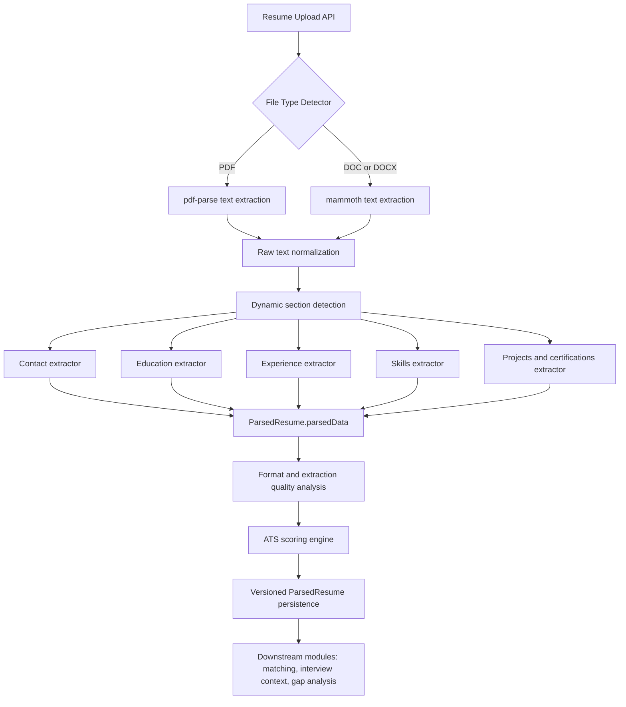
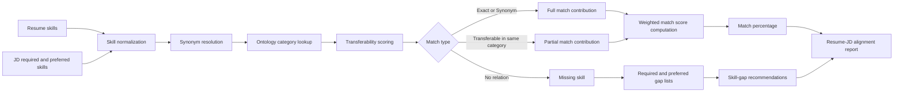
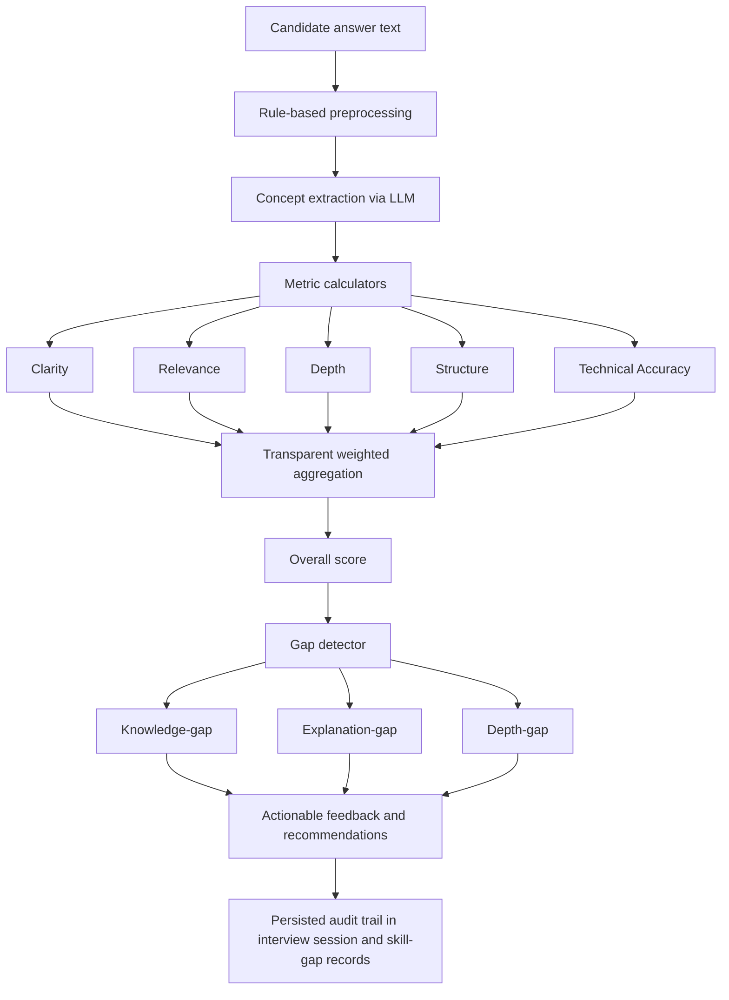
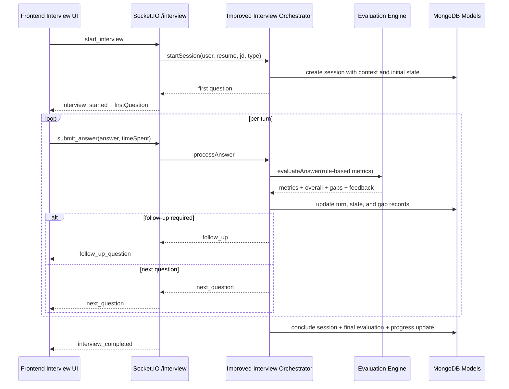
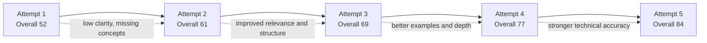
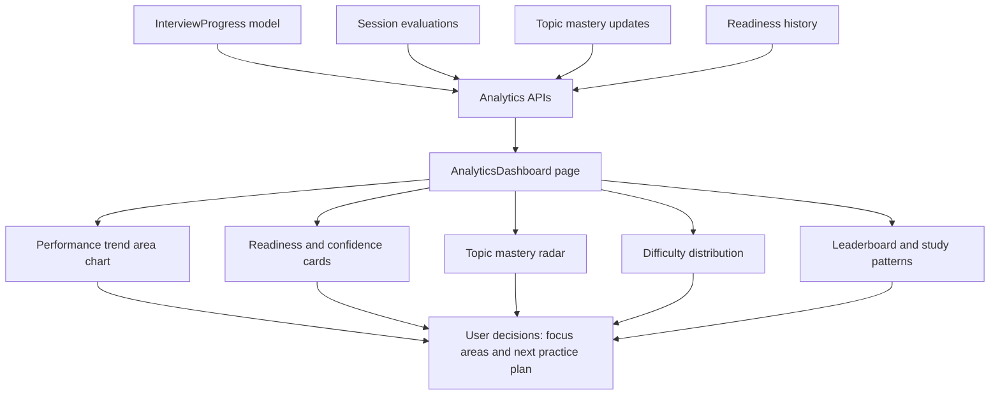
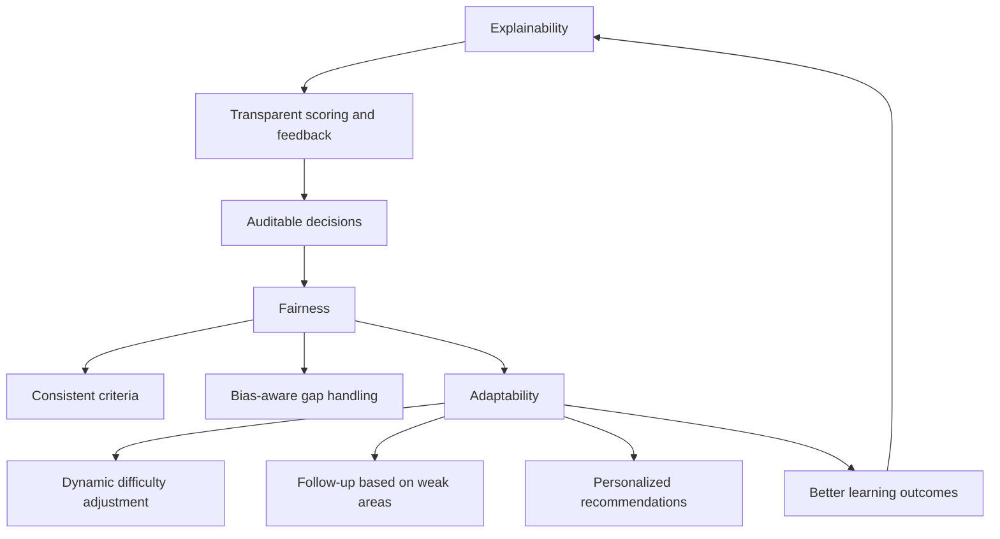
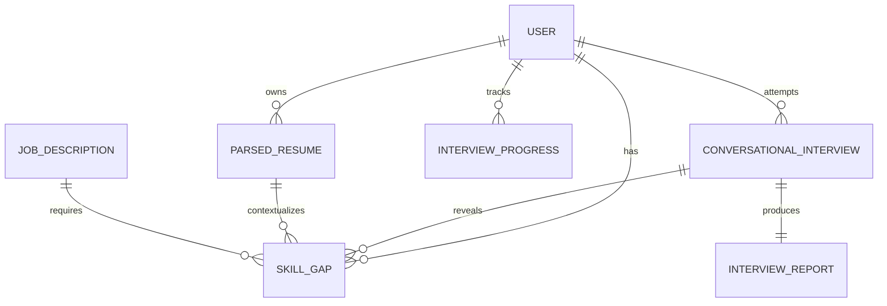

# PrepForge Diagrams and Tables (Project-Aligned)

This document consolidates the requested diagrams and tables based on the current PrepForge/PrepWiser codebase analysis, including backend services, schemas, Socket.IO flows, and analytics modules.

## 1.1 Resume Intelligence and Parsing Workflow

## 1.2 Semantic Candidate-Job Matching Flow

## 1.3 Explainable AI Integration in Recruitment

## 1.4 AI-Based Interview Simulation Workflow

## 5.1 Sample Score Improvement Across Attempts

## 5.2 Trend Analysis Dashboard

## 6.1 Relationship Between Explainability, Fairness, and Adaptability

## 2.2 Research Gap Summary

| Gap in Prior Work | Evidence in Literature Context | Project Response in PrepForge | Remaining Open Challenge |
|---|---|---|---|
| Black-box recruitment scoring | Many systems provide limited decision transparency | Rule-based evaluation engine with explicit metric formulas and weighted aggregation | Semantic concept extraction still uses LLM parsing and can introduce variability |
| Weak linkage between resume analysis and interview adaptation | Resume/JD tools often disconnected from interview flow | Session context carries candidate skills, required skills, and identified gaps into question selection | Cross-session personalization can be improved with stronger longitudinal memory |
| Binary matching instead of semantic transferability | Keyword matching misses related skill transfer | Ontology-driven matching with synonym and transferability scoring | Transferability matrix is static and needs periodic domain calibration |
| Limited actionable remediation | Reports often show score but not closure plans | Gap records include type, severity, priority, and recommended actions | Resource recommendation quality depends on curated content freshness |
| Low audit readiness for fairness checks | Difficulty tracing why outcomes occurred | Persistent turn-level evaluations, gaps, and readiness history | Dedicated fairness dashboards and demographic parity monitoring not fully integrated |

## 2.3 Skill Gap Taxonomy

| Gap Type | Operational Definition | Typical Detection Signal | Severity Defaults | Suggested Action Pattern |
|---|---|---|---|---|
| knowledge-gap | Required concept not demonstrated | Expected concept absent from answer concepts | high or critical | learn fundamentals, targeted practice, project build |
| explanation-gap | Concept appears but articulation is weak | relevance acceptable but depth low; weak explanation evidence | medium | practice explaining with examples and analogies |
| depth-gap | Surface-level answer lacking detail/trade-offs | structure moderate/high but depth low | medium | advanced use cases, trade-off analysis, detailed examples |
| application-gap | Concept known but poor applied reasoning | answer fails scenario or use-case translation | medium to high | problem-solving drills and case-based practice |
| resume-missing | JD-required skill absent from resume profile | resume vs JD required-skill comparison | high | learn skill and add validated evidence to resume |
| interview-missing | Resume-listed skill not validated in interview | skill listed but not shown across interview turns | medium | focused validation questions and demonstration practice |

## 3.4 Core Data Entities and Relationships

| Entity | Primary Responsibility | Key Relationship Links |
|---|---|---|
| User | Identity, profile, interview history | one-to-many with ParsedResume, ConversationalInterview, InterviewProgress, SkillGap |
| ParsedResume | Structured resume representation, ATS results, versions | many-to-one with User; referenced by ConversationalInterview and SkillGap |
| JobDescription | Required/preferred skills and role context | linked to sessions and gap analysis records |
| ConversationalInterview | Turn-level interview session state and evaluation | many-to-one with User; references resume and contains evaluation turns |
| SkillGap | Gap evidence, severity, recommendation, closure state | many-to-one with User; optional links to resume, JD, interview session |
| InterviewProgress | Longitudinal trend and readiness evolution | aggregates multiple interview sessions for one user-role pair |
| InterviewReport | Final report artifact for completed sessions | linked to completed interview session and user history |

## 4.2 Gap Detection Rules

| Rule ID | Trigger Condition | Gap Output | Severity | Engine Source |
|---|---|---|---|---|
| G1 | requiredConcept not found in extracted concepts | knowledge-gap for that concept | high | EvaluationEngine.detectGaps |
| G2 | relevance >= 60 and depth < 50 | explanation-gap on articulation | medium | EvaluationEngine.detectGaps |
| G3 | structure >= 70 and depth < 50 | depth-gap on detailed understanding | medium | EvaluationEngine.detectGaps |
| G4 | skill required by JD but absent in resume skill set | resume-missing | high | SkillGap identify from comparison |
| G5 | turn overall score < 50 for probed concepts | struggling area update and likely follow-up | medium to high | InterviewOrchestrator.updateSessionState |
| G6 | repeated low scores in recent turns | confidence drop and adaptive easier difficulty | context-state impact | InterviewOrchestrator.updateSessionState |

## 4.4 Interview State Variables

| Variable | Meaning | Update Moment | Typical Use |
|---|---|---|---|
| status | session lifecycle state | start, pause/abandon, completion | controls allowed actions |
| currentTurn | active turn index | each new question turn | stop conditions and progress UI |
| topicsCovered | unique concepts already asked | after each evaluated turn | coverage control and analytics |
| skillsProbed | skills tested in session | per-turn from expected concepts | termination readiness checks |
| difficultyLevel | current adaptive difficulty | after recent score window analysis | select easier/harder next question |
| confidenceEstimate | derived short-term confidence | after recent scores | readiness and coaching signals |
| strugglingAreas | low-performing concepts | low score turns | prioritize reinforcement questions |
| strongAreas | high-performing concepts | high score turns | avoid over-testing mastered topics |
| performanceTrend | score history over turns | each evaluated turn | adaptation and post-session analytics |
| followUpReason | reason for probing question | when follow-up flagged | transparent interviewer behavior |

## 5.4 Risk Analysis and Mitigation

| Risk | Impact | Detection Signal | Mitigation in Current System | Residual Risk |
|---|---|---|---|---|
| Resume parsing failure for uncommon formats | incomplete candidate profile | low extraction confidence, failed sections | dynamic parser fallback, partial extraction, format quality metrics | rare layouts may still reduce extraction quality |
| WebSocket interruption during interview | lost user flow or context | disconnect and reconnect events | namespace reconnection, session persisted in DB, room-based continuation | brief UI desync possible during reconnect window |
| Over-reliance on generated language quality | inconsistent interview wording | unstable prompt outputs | deterministic scoring decoupled from generation | question phrasing quality can vary by model response |
| False-positive or false-negative gap classification | misdirected learning path | mismatch between observed performance and gap labels | multi-metric thresholds, evidence fields, progress notes | threshold tuning needed per domain and role |
| Bias leakage through indirect signals | unfair recommendations or evaluations | persistent group-level disparities (if monitored) | explicit explainability layer, auditable rules, no black-box scoring | dedicated fairness monitoring pipeline still needed |
| Metric gaming (keyword stuffing or rehearsed templates) | inflated scores without true competence | high relevance with weak depth/accuracy patterns | depth and structure checks, follow-up questions on weak areas | sophisticated gaming can still occur without adversarial checks |

---

Prepared for direct inclusion in research and project documentation.
