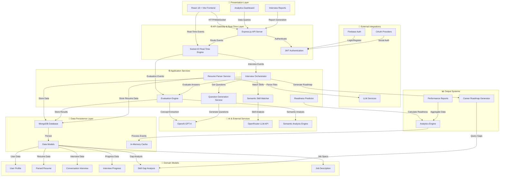

# PrepForge: Complete System Architecture

## Executive Overview

PrepForge is an AI-powered adaptive interview preparation platform that combines skill gap analysis, conversational interviews, and real-time evaluation to provide candidates with personalized career roadmaps. The system leverages machine learning, semantic analysis, and rule-based evaluation to deliver targeted feedback and improvement recommendations.

---

## System Architecture Diagram



---

## Core Components

### 1. **Presentation Layer** 🎨
The user-facing interface built with React 18 and Vite for optimal performance.

**Key Components:**
- **Interview Interface:** Real-time chat for conversational and coding interviews
- **Analytics Dashboard:** Performance trends, readiness scores, topic mastery
- **Reports Page:** Interview transcripts, skill gap analysis, career roadmaps
- **Profile Management:** Resume upload, job description input, career goals

**Technologies:** React 18, Zustand (state management), Recharts (analytics), Tailwind CSS, Socket.IO Client

---

### 2. **API Gateway & Real-Time Layer** 🌐
Express.js server with Socket.IO for real-time bidirectional communication.

**Responsibilities:**
- RESTful API endpoints for CRUD operations
- WebSocket connection management via Socket.IO
- JWT token validation and user authentication
- Request/response middleware pipeline

**Namespaces:**
- `/interview` - Conversational interview events
- `/coding-interview-v2` - Coding challenge sessions
- `/collaboration` - Team collaboration features

---

### 3. **Application Services** ⚙️
Core business logic services orchestrating PrepForge workflows.

#### **Interview Orchestrator** (`interviewOrchestrator.js`)
- Controls interview session lifecycle
- Manages question selection and adaptive difficulty
- Handles follow-up generation based on answers
- Tracks interview state and progression
- Determines interview completion criteria

**Key Methods:**
```
startSession() → Initialize interview with JD + resume
processAnswer(answer) → Evaluate & generate next question
updateSessionState() → Track progress & difficulty adaptation
shouldContinueInterview() → Determine if more questions needed
concludeSession() → Generate final evaluation & gaps
```

#### **Evaluation Engine** (`evaluationEngine.js`)
- Rule-based answer evaluation (no LLM for scoring to ensure transparency)
- Calculates 5 metrics: clarity, relevance, depth, structure, technical accuracy
- Detects skill gaps with evidence-based classification
- Generates corrective feedback

**Scoring Formula:**
```
Overall Score = (Clarity × 0.2 + Relevance × 0.3 + Depth × 0.25 + 
                Structure × 0.15 + Technical Accuracy × 0.1)
```

#### **Semantic Skill Matcher** (`semanticSkillMatcher.js`)
- Matches candidate skills against job requirements
- Classifies gaps: knowledge-gap, explanation-gap, depth-gap, application-gap
- Calculates transferability (70-80% within category, 30-50% across categories)
- Prioritizes gaps by severity and frequency

**Gap Severity Levels:**
- 🔴 Critical - Missing core requirement
- 🟠 High - Significant weakness in key area
- 🟡 Medium - Development opportunity
- 🟢 Low - Nice-to-have skill

#### **Question Generation Service** (`questionGenerationService.js`)
- Generates role-specific interview questions using GPT-4
- Adapts difficulty based on candidate performance
- Creates follow-up questions for deeper exploration
- Ensures variety and comprehensive skill coverage

#### **Resume Parser Service** (`resumeParserService.js`)
- Multi-format support (PDF, DOCX, TXT)
- Extracts: contact info, education, experience, skills
- Calculates ATS compatibility score
- Normalizes skill terminology

#### **Readiness Predictor** (`readinessPredictor.js`)
- Analyzes performance trends across interview turns
- Calculates interview readiness score (0-100)
- Identifies improvement trajectories
- Predicts success probability for target role

---

### 4. **AI & External Services** 🧠

#### **OpenAI GPT-4**
- Question generation and follow-up creation
- Concept extraction from answers
- Resume parsing and skill extraction
- Career roadmap generation

#### **OpenRouter LLM API**
- Alternative LLM provider for redundancy
- Semantic skill analysis and matching
- Skill transferability assessment

#### **Semantic Analysis Engine**
- Local semantic similarity calculations
- Context extraction from interview responses
- Skill entity recognition and normalization

---

### 5. **Data Persistence Layer** 💾

#### **MongoDB Collections:**

**User Model**
```javascript
{
  _id: ObjectId,
  email: String,
  password: String,
  fullName: String,
  firebaseUID: String,
  createdAt: Date,
  profile: { resumeID, targetRole, yearsOfExperience }
}
```

**ParsedResume Model**
```javascript
{
  _id: ObjectId,
  userID: ObjectId,
  rawText: String,
  contactInfo: { phone, email, location },
  education: [{ degree, institution, field, year }],
  experience: [{ company, role, duration, description }],
  skills: [{ name, category, proficiency }],
  atsScore: Number
}
```

**ConversationalInterview Model**
```javascript
{
  _id: ObjectId,
  userID: ObjectId,
  interviewType: String, // 'conversational' | 'coding' | 'behavioral'
  targetRole: String,
  status: String, // 'in-progress' | 'completed'
  turns: [{
    turnNumber: Number,
    question: String,
    answer: String,
    evaluation: {
      clarity: 0-100,
      relevance: 0-100,
      depth: 0-100,
      structure: 0-100,
      technicalAccuracy: 0-100,
      overall: 0-100
    }
  }],
  sessionState: {
    topicsCovered: [String],
    skillsProbed: [String],
    difficultyLevel: Number,
    strugglingAreas: [String],
    strongAreas: [String]
  },
  finalEvaluation: Object,
  createdAt: Date,
  completedAt: Date
}
```

**SkillGap Model**
```javascript
{
  _id: ObjectId,
  interviewID: ObjectId,
  skillName: String,
  gapType: String, // knowledge-gap | explanation-gap | depth-gap | application-gap
  severity: String, // critical | high | medium | low
  fromResume: { present: Boolean, location: String, context: String },
  fromJD: { required: Boolean, preferred: Boolean, frequency: Number },
  fromInterview: { asked: Boolean, turnNumbers: [Number], averageScore: Number },
  evidence: String,
  recommendation: String
}
```

**InterviewProgress Model**
```javascript
{
  _id: ObjectId,
  userID: ObjectId,
  scoreTrends: {
    clarity: [Number],
    relevance: [Number],
    depth: [Number],
    structure: [Number],
    technicalAccuracy: [Number]
  },
  topicMastery: [{
    topic: String,
    attempts: Number,
    averageScore: Number,
    trend: String // 'improving' | 'stable' | 'declining'
  }],
  readinessHistory: [{ date: Date, score: Number }],
  lastInterview: Date
}
```

---

### 6. **Domain Models** 📱

**Job Description (JD)**
- Required skills with proficiency levels
- Preferred qualifications
- Role-specific keywords
- Experience requirements
- Industry/domain context

**Skill Gap Analysis**
- Gap classification with evidence
- Source tracking (resume/JD/interview)
- Severity assessment
- Remediation recommendations

---

### 7. **External Integrations** 🔧

#### **Firebase Authentication**
- Email/password signup and login
- Password reset functionality
- Session token management

#### **OAuth Providers**
- Google authentication
- GitHub authentication
- LinkedIn integration (planned)

#### **LLM Services**
- Model versioning and fallback support
- Rate limiting and cost optimization
- Error handling and retry logic

---

### 8. **Output Systems** 📊

#### **Analytics Engine**
- Aggregates interview performance data
- Calculates trend analysis
- Identifies patterns in candidate performance
- Generates insights and predictions

#### **Career Roadmap Generator**
- Maps skill gaps to learning resources
- Prioritizes gaps by impact and effort
- Suggests interview preparation topics
- Tracks roadmap progress

#### **Performance Reports**
- Interview transcripts with evaluations
- Skill assessment summary
- Gap prioritization matrix
- Personalized recommendations

---

## Technology Stack

| Layer | Technology | Purpose |
|-------|-----------|---------|
| **Frontend** | React 18, Vite | UI framework & build tool |
| **State Management** | Zustand | Application state |
| **Real-Time** | Socket.IO | WebSocket communication |
| **Backend** | Node.js, Express.js | API server |
| **Database** | MongoDB, Mongoose | Data persistence & ODM |
| **AI/ML** | OpenAI GPT-4, OpenRouter | LLM services |
| **Analytics** | Recharts | Data visualization |
| **Styling** | Tailwind CSS | UI styling |
| **Authentication** | Firebase, JWT | User authentication |

---

## Key Design Principles

### 1. **Separation of Concerns**
Each service handles a single responsibility:
- Orchestrator: session management
- Evaluator: answer assessment
- Matcher: skill analysis
- QGen: question creation

### 2. **Transparency in Evaluation**
Rule-based scoring (no LLM) ensures:
- Reproducible results
- Explainable feedback
- Fair assessment

### 3. **Real-Time Responsiveness**
WebSocket-based communication enables:
- Instant feedback loops
- Live performance tracking
- Collaborative sessions

### 4. **Adaptive Difficulty**
Interview adjusts to candidate level:
- Difficulty increases with strong answers
- Difficulty decreases with weak answers
- Targeted follow-ups based on gaps

### 5. **Evidence-Based Gap Analysis**
Gaps tracked from three sources:
- Resume (what candidate claims)
- Job Description (what's required)
- Interview (what candidate demonstrates)

---

## Data Flow: A Typical Interview Session

```
1. INITIALIZATION
   Candidate logs in → Upload resume + Enter target role
   ↓
2. PARSING & ANALYSIS
   Resume Parser extracts skills
   Semantic Matcher compares to JD
   ↓
3. SESSION START
   Interview Orchestrator initializes session
   Question Generator creates first question
   ↓
4. INTERVIEW LOOP
   Candidate answers → Evaluation Engine scores
   ↓
5. FEEDBACK & ADAPTATION
   System calculates gap analysis
   Determines next question difficulty
   ↓
6. CONTINUATION CHECK
   If more topics to explore → Generate follow-up
   If coverage sufficient → Begin conclusion
   ↓
7. SESSION CONCLUSION
   Final skill assessment compiled
   Career roadmap generated
   Performance report created
   ↓
8. OUTPUT DELIVERY
   Reports displayed on Analytics Dashboard
   Roadmap recommendations provided
```

---

## System Interactions

### Interview Flow
```
User Input (Answer) 
   → Socket.IO emit: submit_answer
   → Orchestrator receives event
   → Evaluator scores answer (5 metrics)
   → Matcher detects gaps
   → QGen creates next question
   → Socket.IO emit: feedback + next_question
   → UI updates with feedback and new question
```

### Analysis Flow
```
Interview Complete
   → Orchestrator concludes session
   → All turns sent to Evaluator
   → Matcher generates gap report
   → Predictor calculates readiness
   → Roadmap Generator creates recommendations
   → Reports persisted to MongoDB
   → Analytics Dashboard updated
```

### Real-Time Updates
```
During Interview
   → Performance metrics streamed live
   → Trend calculations updated
   → Readiness score recalculated
   → Topic mastery adjusted
   → UI reflects changes instantly
```

---

## Deployment Architecture

### Development Environment
- Local MongoDB instance
- Node.js development server
- Vite dev server with HMR
- Local Socket.IO connections

### Production Environment
- Cloud-hosted MongoDB (Atlas/Azure)
- Docker containerization
- Kubernetes orchestration (optional)
- CDN for frontend assets
- SSL/TLS encryption
- Rate limiting and DDoS protection

---

## Scalability Considerations

### Horizontal Scaling
- Load balancing across Express servers
- Socket.IO adapter for multi-instance support
- MongoDB sharding for large datasets

### Vertical Scaling
- Caching layer for frequently accessed data
- Database query optimization
- Asset minification and compression

### Performance Optimization
- Code splitting on frontend
- Lazy loading of components
- Database indexing
- API response compression

---

## Security Features

### Authentication
- JWT token-based API authentication
- Firebase authentication integration
- OAuth 2.0 provider support
- Session token expiration

### Data Protection
- MongoDB encryption at rest
- HTTPS/TLS for data in transit
- Input validation and sanitization
- CORS policy enforcement

### Privacy
- User data isolation
- Secure password hashing
- Audit logging of sensitive operations
- GDPR compliance measures

---

## Summary

PrepForge's architecture is designed for:
- ✅ **Transparency:** Rule-based evaluation with explainable scores
- ✅ **Adaptability:** Dynamic difficulty and personalized learning paths
- ✅ **Real-time Feedback:** WebSocket-based instant communication
- ✅ **Evidence-Based Analysis:** Multi-source skill gap detection
- ✅ **Scalability:** Distributed architecture with caching and optimization
- ✅ **Security:** Comprehensive authentication and data protection

This unified system creates a seamless experience from resume upload through interview completion, delivering actionable insights and career advancement recommendations.
