# PrepForge: Complete Web Workflow

## End-to-End Candidate Journey

This document maps the complete flow of a candidate through the PrepForge platform, from initial signup through insights delivery and career roadmap generation.

---

## Complete Web Workflow Diagram

```mermaid
graph TD
    Start([Candidate Visits PrepForge]) --> SignUp{Already<br/>Registered?}
    
    SignUp -->|No| Register["📝 SIGNUP PHASE<br/>Email/Password or OAuth"]
    SignUp -->|Yes| Login["🔑 LOGIN PHASE<br/>Email/Password or OAuth"]
    
    Register --> CreateProfile["👤 CREATE PROFILE<br/>- Full Name<br/>- Target Role<br/>- Years of Experience"]
    CreateProfile --> UploadResume["📄 UPLOAD RESUME"]
    
    Login --> Dashboard["📊 DASHBOARD HOME<br/>View Previous Interviews<br/>Career Progress<br/>Skill Gaps"]
    
    UploadResume --> ParsePhase["🔍 PARSE & ANALYZE PHASE"]
    Dashboard --> SelectInterview["🎯 SELECT INTERVIEW TYPE"]
    
    ParsePhase --> FileDetect["Detect File Format<br/>PDF/DOCX/TXT"]
    FileDetect --> Extract["Extract Resume Content<br/>- Contact Info<br/>- Education<br/>- Experience<br/>- Skills"]
    Extract --> NormSkills["Normalize Skills<br/>Resolve Synonyms<br/>Map to Categories"]
    NormSkills --> CalcATS["Calculate ATS Score<br/>0-100"]
    CalcATS --> StoreResume["Store in Database<br/>ParsedResume Collection"]
    StoreResume --> ShowSkills["Display Parsed Skills<br/>Show ATS Score"]
    ShowSkills --> EnterJD["💼 ENTER TARGET JOB DESCRIPTION<br/>- Paste Job Post OR<br/>- Manual Skill Entry"]
    
    SelectInterview --> InterviewType{Interview<br/>Type?}
    EnterJD --> ProcessJD["Process Job Description<br/>Extract Required Skills<br/>Categorize by Priority"]
    
    InterviewType -->|Conversational| ConvType["Conversational Interview:<br/>Natural discussion<br/>Depth exploration"]
    InterviewType -->|Coding| CodingType["Coding Interview:<br/>Algorithm problems<br/>Live coding environment"]
    InterviewType -->|Behavioral| BehavType["Behavioral Interview:<br/>Situation-based<br/>STAR method"]
    
    ProcessJD --> MatchPhase["⚡ SKILL MATCHING PHASE"]
    ConvType --> MatchPhase
    CodingType --> MatchPhase
    BehavType --> MatchPhase
    
    MatchPhase --> CompareSkills["Semantic Skill Matcher:<br/>Compare Resume Skills<br/>vs JD Requirements"]
    CompareSkills --> CalcTransfer["Calculate Transferability:<br/>- Same Category: 70-80%<br/>- Different Category: 30-50%<br/>- No Relevance: 0%"]
    CalcTransfer --> ClassifyGaps["Classify Initial Gaps:<br/>- Knowledge Gap<br/>- Explanation Gap<br/>- Depth Gap<br/>- Application Gap<br/>- Resume Missing<br/>- Interview Missing"]
    ClassifyGaps --> PrioritizeGaps["Prioritize Gaps by:<br/>- Severity: Critical/High/Medium/Low<br/>- Frequency in JD<br/>- Impact on Role"]
    PrioritizeGaps --> StoreMatcher["Store Gap Analysis<br/>SkillGap Collection"]
    
    StoreMatcher --> InterviewStart["🎬 INTERVIEW SESSION START"]
    
    InterviewStart --> InitSession["Initialize Session:<br/>- Create ConversationalInterview record<br/>- Set initial difficulty level<br/>- Load gap priorities<br/>- Select focus areas"]
    InitSession --> GenQ1["Generate Question 1<br/>Using GPT-4:<br/>- Role-specific<br/>- Addresses top gap<br/>- Appropriate difficulty"]
    GenQ1 --> DisplayQ1["Display Question to Candidate"]
    
    DisplayQ1 --> AnswerLoop["💬 INTERVIEW LOOP<br/>(Repeats for 8-12 turns)"]
    
    AnswerLoop --> CandidateAnswer["Candidate Types Answer"]
    CandidateAnswer --> SubmitAnswer["Submit via Socket.IO"]
    SubmitAnswer --> ReceiveAnswer["Orchestrator Receives Answer<br/>via WebSocket"]
    
    ReceiveAnswer --> EvalPhase["📊 EVALUATION PHASE<br/>Rule-Based 5-Metric Scoring"]
    
    EvalPhase --> Clarity["Clarity Score (20%)<br/>- Sentence structure<br/>- Communication clarity<br/>- Explanation quality"]
    Clarity --> Relevance["Relevance Score (30%)<br/>- Answer addresses question<br/>- No off-topic tangents<br/>- Pertinent examples"]
    Relevance --> Depth["Depth Score (25%)<br/>- Level of technical detail<br/>- Examples provided<br/>- Explores nuances"]
    Depth --> Structure["Structure Score (15%)<br/>- Logical flow<br/>- Well-organized<br/>- Easy to follow"]
    Structure --> Technical["Technical Accuracy (10%)<br/>- Correct terminology<br/>- Accurate facts<br/>- Best practices alignment"]
    Technical --> CalcOverall["Calculate Overall Score<br/>= (C×0.2 + R×0.3 + D×0.25 + S×0.15 + T×0.1)"]
    CalcOverall --> StoreEval["Store Evaluation<br/>in Turn Record"]
    
    StoreEval --> GapDetect["🔎 GAP DETECTION<br/>Analyze Answer Content"]
    
    GapDetect --> ExtractConcepts["Extract Concepts from Answer<br/>Using Semantic Analysis"]
    ExtractConcepts --> CompareToJD["Compare Concepts<br/>to JD Requirements"]
    CompareToJD --> DetectMissing["Detect Missing Concepts:<br/>- Unexplored topics<br/>- Weak explanations<br/>- Surface-level knowledge"]
    DetectMissing --> UpdateGaps["Update SkillGap Records:<br/>- Mark as 'asked'<br/>- Record score<br/>- Log evidence"]
    
    UpdateGaps --> FeedbackGen["💡 FEEDBACK GENERATION"]
    
    FeedbackGen --> GenCorrective["Generate Corrective Feedback:<br/>- What was good<br/>- What needs improvement<br/>- Specific examples<br/>- Resources to study"]
    GenCorrective --> SendFeedback["Send Feedback to Candidate<br/>via Socket.IO"]
    SendFeedback --> DisplayFeedback["Display Feedback in UI<br/>Show Score Breakdown<br/>Highlight Gaps"]
    
    DisplayFeedback --> AdaptDiff["🎚️ ADAPT DIFFICULTY"]
    
    AdaptDiff --> CheckScore{"Overall<br/>Score?"}
    CheckScore -->|≥ 75| IncreaseDiff["Increase Difficulty:<br/>- Next question harder<br/>- Deeper topics<br/>- Edge cases"]
    CheckScore -->|60-74| MaintainDiff["Maintain Difficulty:<br/>- Same level<br/>- Different topic"]
    CheckScore -->|< 60| DecreaseDiff["Decrease Difficulty:<br/>- Simpler concepts<br/>- Fundamentals<br/>- Basic explanations"]
    
    IncreaseDiff --> FollowUpDecision
    MaintainDiff --> FollowUpDecision
    DecreaseDiff --> FollowUpDecision
    
    FollowUpDecision{"Need<br/>Follow-up?"}
    
    FollowUpDecision -->|Yes| GenFollowUp["Generate Follow-up Question:<br/>- Probe deeper on topic<br/>- Challenge weak answer<br/>- Verify understanding"]
    FollowUpDecision -->|No| ContinueCheck
    
    GenFollowUp --> DisplayFollowUp["Display Follow-up Question"]
    DisplayFollowUp --> AnswerLoop
    
    ContinueCheck{"Coverage<br/>Sufficient?"}
    
    ContinueCheck -->|No| SelectNextGap["Select Next Gap Priority:<br/>- Check remaining gaps<br/>- Pick high-impact area<br/>- Generate question"]
    SelectNextGap --> GenNextQ["Generate New Question<br/>for Next Gap"]
    GenNextQ --> DisplayNextQ["Display Question"]
    DisplayNextQ --> AnswerLoop
    
    ContinueCheck -->|Yes| TurnLimit{"Max<br/>Turns<br/>Reached?"}
    
    TurnLimit -->|No| ContinueCheck
    TurnLimit -->|Yes| EndInterview["🏁 END INTERVIEW SESSION"]
    
    EndInterview --> CompileResults["Compile Interview Results:<br/>- All turn evaluations<br/>- Gap evidence<br/>- Performance trends"]
    
    CompileResults --> FinalEval["📋 FINAL EVALUATION"]
    
    FinalEval --> CalcTrends["Calculate Performance Trends:<br/>- Average scores per metric<br/>- Improvement/decline<br/>- Consistency analysis"]
    CalcTrends --> AnalyzeTopics["Analyze Topic Coverage:<br/>- Topics explored<br/>- Depth achieved<br/>- Gaps identified"]
    AnalyzeTopics --> CalcReadiness["Calculate Readiness Score:<br/>- Weighted gap severity<br/>- Performance consistency<br/>- Coverage completeness<br/>Score: 0-100"]
    CalcReadiness --> GenRoadmap["🛣️ GENERATE ROADMAP"]
    
    GenRoadmap --> PrioritizeAll["Prioritize All Gaps:<br/>Severity × Frequency × Impact"]
    PrioritizeAll --> MapResources["Map to Resources:<br/>- Documentation links<br/>- Tutorial recommendations<br/>- Practice problems"]
    MapResources --> CreateStages["Create Learning Stages:<br/>- Stage 1: Fundamentals<br/>- Stage 2: Intermediate<br/>- Stage 3: Advanced<br/>- Stage 4: Mastery"]
    CreateStages --> EstimateTiming["Estimate Study Time:<br/>- Per gap<br/>- Per stage<br/>- Total duration"]
    EstimateTiming --> StoreRoadmap["Store Roadmap<br/>in Database"]
    
    StoreRoadmap --> GenerateReports["📄 GENERATE REPORTS"]
    
    GenerateReports --> TranscriptReport["Interview Transcript:<br/>- All Q&A pairs<br/>- Scores per turn<br/>- Feedback provided"]
    TranscriptReport --> AssessmentReport["Skill Assessment Report:<br/>- Each skill evaluated<br/>- Score per skill<br/>- Proficiency level<br/>- Evidence cited"]
    AssessmentReport --> GapReport["Gap Analysis Report:<br/>- All gaps identified<br/>- Classification<br/>- Severity ranking<br/>- Evidence sources"]
    GapReport --> RoadmapReport["Career Roadmap:<br/>- Prioritized gaps<br/>- Learning path<br/>- Resources<br/>- Milestones"]
    
    RoadmapReport --> StoreReports["Store All Reports<br/>in Database"]
    
    StoreReports --> UpdateAnalytics["📊 UPDATE ANALYTICS"]
    
    UpdateAnalytics --> CalcMetrics["Calculate Metrics:<br/>- Interview count<br/>- Total questions<br/>- Average readiness<br/>- Topics covered"]
    CalcMetrics --> UpdateTrends["Update Performance Trends:<br/>- Score progression<br/>- Skill improvement<br/>- Gap closure rate"]
    UpdateTrends --> CreateCharts["Generate Chart Data:<br/>- Area chart: Score trends<br/>- Radar: Topic mastery<br/>- Bar: Metric breakdown"]
    CreateCharts --> CacheResults["Cache Results<br/>In-Memory"]
    
    CacheResults --> DisplayDashboard["🎨 DISPLAY DASHBOARD"]
    
    DisplayDashboard --> ShowResults["Show Interview Results:<br/>- Overall readiness<br/>- Metric breakdown<br/>- Gap summary"]
    ShowResults --> ShowTrends["Show Performance Trends:<br/>- Progress over time<br/>- Improvement areas<br/>- Skill trajectories"]
    ShowTrends --> ShowRoadmap["Show Career Roadmap:<br/>- Prioritized gaps<br/>- Learning stages<br/>- Time estimates"]
    ShowRoadmap --> OfferNext["Offer Next Actions:<br/>- Re-interview same role<br/>- Interview different role<br/>- Download reports<br/>- Share progress"]
    
    OfferNext --> End([Session Complete])
    
    End --> RepeatPhase{Continue<br/>Prep?}
    
    RepeatPhase -->|New Interview| SelectInterview
    RepeatPhase -->|Study Materials| StudyMode["📚 STUDY MODE<br/>- Review gaps<br/>- Study resources<br/>- Practice problems"]
    RepeatPhase -->|Exit| Logout["🚪 LOGOUT<br/>Session ends<br/>Progress saved"]
    
    StudyMode --> MarkComplete["Mark Gap Items Complete"]
    MarkComplete --> SelectInterview
    
    Logout --> End2([End Session])
```



---

## Phase-by-Phase Breakdown

### **PHASE 1: Authentication & Profile Setup** (Minutes 0-5)

**User Actions:**
1. Visit prepwiser.ai
2. Choose signup or login
3. Create account with email/password or OAuth
4. Fill profile (name, target role, experience)
5. Upload resume (PDF, DOCX, or TXT)

**System Actions:**
1. Validate credentials
2. Create User record in MongoDB
3. Detect file format and parse resume
4. Extract education, experience, skills
5. Normalize skill terminology
6. Calculate ATS compatibility score
7. Store ParsedResume in database

**Data Created:**
- User document
- ParsedResume document
- Initial profile metadata

**User Sees:**
- Confirmation message
- Parsed skills display
- ATS score badge
- Dashboard home

---

### **PHASE 2: Job Analysis & Skill Matching** (Minutes 5-15)

**User Actions:**
1. Paste job description or enter skills manually
2. Confirm job role and company
3. Review suggested gaps
4. Choose interview type (conversational/coding/behavioral)

**System Actions:**
1. Parse job description with GPT-4
2. Extract required skills and proficiency levels
3. Run Semantic Skill Matcher
4. Calculate transferability scores
5. Classify gaps (knowledge/explanation/depth/application/missing)
6. Prioritize by severity and frequency
7. Store initial gap analysis

**Data Created:**
- JobDescription document
- Initial SkillGap records (pre-interview)
- Gap classification matrix

**User Sees:**
- Matched skills list
- Gap analysis summary
- Proficiency level comparisons
- Interview type selection screen

---

### **PHASE 3: Interview Initialization** (Minutes 15-20)

**User Actions:**
1. Confirm interview start
2. Read welcome/instructions
3. Confirm ready to begin

**System Actions:**
1. Initialize ConversationalInterview session
2. Set initial difficulty level (medium)
3. Select top 3 gaps to probe
4. Generate first question using GPT-4
5. Create first turn record

**Data Created:**
- ConversationalInterview document
- sessionState initialized

**User Sees:**
- Interview welcome screen
- First question displayed
- Answer input field ready
- Timer started (optional)

---

### **PHASE 4: Main Interview Loop** (Minutes 20-55, 8-12 turns)

**Per Turn (Average 3-4 minutes each):**

**User Actions:**
1. Read question
2. Type answer (200-500 words typical)
3. Click Submit

**System Actions:**

**Step 4.1: Receive & Store Answer**
- Socket.IO receives answer via `/interview` namespace
- Store in turn record immediately
- Emit receipt confirmation

**Step 4.2: Evaluation (Rule-Based)**
- Calculate Clarity (0-100): Grammar, coherence, communication quality
- Calculate Relevance (0-100): Addresses question, on-topic, pertinent examples
- Calculate Depth (0-100): Technical detail, explores nuances, mentions edge cases
- Calculate Structure (0-100): Logical flow, organization, easy to follow
- Calculate Technical Accuracy (0-100): Correct terminology, accurate facts, best practices

**Overall Score Formula:**
```
Overall = (Clarity × 0.2) + (Relevance × 0.3) + (Depth × 0.25) + 
          (Structure × 0.15) + (Technical Accuracy × 0.1)
```

**Step 4.3: Gap Detection**
- Extract semantic concepts from answer using GPT-4
- Match against JD requirements
- Identify missing topics/explanations
- Update SkillGap records with evidence

**Step 4.4: Feedback Generation**
- Generate corrective feedback with GPT-4
- Highlight strengths
- Suggest improvements
- Provide resource links

**Step 4.5: Difficulty Adaptation**
- If score ≥ 75: Increase next question difficulty
- If score 60-74: Maintain difficulty
- If score < 60: Decrease difficulty

**Step 4.6: Follow-up Decision**
- If gap still unclear: Generate follow-up question
- Else: Select next gap priority

**Step 4.7: Send to Frontend**
- Emit via Socket.IO: feedback, score, metrics
- Emit next question or follow-up

**Data Created Per Turn:**
- Turn record with evaluation metrics
- Updated SkillGap entries
- Feedback entry

**User Sees (2-3 seconds after submit):**
- Score breakdown (5 metrics)
- Feedback message
- Next question or follow-up
- Encouragement based on performance

**Repeat:** Steps 4.1-4.7 for turns 2-12

---

### **PHASE 5: Interview Conclusion** (Minutes 55-60)

**User Actions:**
1. Review final few questions
2. Submit last answer
3. Confirm interview complete

**System Actions:**

**Step 5.1: Finalize Session**
- Mark ConversationalInterview as `completed`
- Set completedAt timestamp
- Lock interview for edits

**Step 5.2: Calculate Trends**
- Compile all 12 turn scores
- Calculate average per metric
- Track improvement/decline trajectory
- Identify consistent strong/weak areas

**Step 5.3: Topic Analysis**
- List topics covered (from turn questions)
- Calculate coverage percentage
- Identify uncovered areas
- Flag urgent remaining gaps

**Step 5.4: Readiness Score**
```
Readiness = (Coverage × 0.3) + (Performance × 0.4) + (GapSeverity × 0.3)

Where:
- Coverage = % of critical gaps probed (0-100)
- Performance = Average overall score (0-100)
- GapSeverity = Inverse of remaining critical gaps (0-100)

Final: 0-100 scale
```

**Step 5.5: Roadmap Generation**
- Prioritize all gaps: severity × frequency × performance
- Create 4-stage learning path:
  - Stage 1 (Week 1-2): Fundamentals for critical gaps
  - Stage 2 (Week 3-4): Intermediate concepts
  - Stage 3 (Week 5-6): Advanced applications
  - Stage 4 (Week 7+): Mastery and practice
- Map to resources (docs, tutorials, LeetCode, GitHub, etc.)
- Estimate study time per gap (2-40 hours)

**Step 5.6: Generate Reports**
- Interview Transcript: All 12 Q&A pairs with scores
- Skill Assessment: Each skill evaluated with proficiency
- Gap Analysis: All gaps with classification and evidence
- Career Roadmap: Prioritized learning path with milestones

**Step 5.7: Update Analytics**
- Calculate trend data (area chart points)
- Update topic mastery (radar chart)
- Compute metric distribution (bar chart)
- Cache for dashboard display

**Data Created:**
- Final evaluation metrics
- Readiness score
- 4 report documents
- Analytics cache entries

**User Sees:**
- Congratulations message
- Overall readiness score (e.g., "67/100")
- Loading screen: "Generating your personalized roadmap..."

---

### **PHASE 6: Results & Analytics Dashboard** (Minutes 60-75)

**User Actions:**
1. Review interview results
2. Check skill assessment
3. Review gap analysis
4. Study roadmap recommendations
5. Choose next action

**System Displays:**

**Section 1: Interview Overview**
- Readiness Score (0-100 gauge)
- Overall Performance (text assessment)
- Interview Duration
- Questions Answered
- Average Score per Metric (table)

**Section 2: Performance Trends** (Area Chart)
- X-axis: Turn number (1-12)
- Y-axis: Score (0-100)
- Lines: One per metric (clarity, relevance, depth, structure, technical)
- Shows: Improvement trajectory over interview

**Section 3: Skill Assessment**
- Table with columns:
  - Skill Name
  - Resume Level (claimed)
  - JD Requirement (needed)
  - Interview Proficiency (demonstrated)
  - Verdict (match/gap/exceeds)

**Section 4: Gap Priority Matrix**
- Table sorted by priority:
  - Gap Name
  - Type (knowledge/explanation/depth/application)
  - Severity (critical/high/medium/low)
  - Evidence (from interview)
  - Recommendation

**Section 5: Career Roadmap** (Detailed)
- **Stage 1: Fundamentals** (e.g., 2 weeks)
  - Gaps to address: Authentication, API Design, Database Indexing
  - Resources: 5 links
  - Time estimate: 15 hours
  - Practice: 3 coding challenges

- **Stage 2: Intermediate** (e.g., 2 weeks)
  - Gaps: Caching, Microservices, Deployment
  - Resources: 8 links
  - Time estimate: 20 hours
  - Projects: 2 mini-projects

- **Stage 3: Advanced** (e.g., 2 weeks)
  - Gaps: System Design, Performance Optimization
  - Resources: 6 links
  - Time estimate: 25 hours
  - Projects: 1 comprehensive project

- **Stage 4: Mastery** (e.g., 4 weeks)
  - Gaps: Interview practice, Behavioral readiness
  - Resources: Mock interview links
  - Time estimate: Ongoing
  - Practice: Weekly mock interviews

**Section 6: Recommendations**
- Next steps for interview prep
- Suggested resources
- Timeline to re-interview
- Share/download options

**User Sees:**
- Comprehensive results dashboard
- All metrics visualized
- Clear prioritized roadmap
- Actionable next steps

---

### **PHASE 7: Continuation & Follow-up** (Variable)

**Option A: Re-Interview Same Role**
- User returns to Phase 3
- System suggests harder questions
- Compares performance to previous interview
- Tracks improvement

**Option B: Interview Different Role**
- User enters new job description
- System re-runs skill matching
- New gap analysis generated
- New interview session begins

**Option C: Study Mode**
- User reviews gaps
- Accesses recommended resources
- Marks gaps as studied
- Can take quizzes/challenges

**Option D: Download & Share**
- Generate PDF reports
- Export as markdown
- Share with mentors
- Track progress over time

**Option E: Logout**
- Session saved
- Progress persists
- Accessible on next login

---

## Key Data Transformations

### Resume Data Flow
```
Upload File → Detect Format → Extract Text → Parse Sections → 
Normalize Skills → Calculate ATS → Store in DB → Display to User
```

### Skill Matching Flow
```
Resume Skills + JD Requirements → Semantic Comparison → 
Transferability Calc → Gap Classification → Priority Matrix → 
Store Gap Records
```

### Interview Scoring Flow
```
User Answer → 5-Metric Calc → Concept Extraction → 
Gap Detection → Feedback Gen → Difficulty Adaptation → 
Store Evaluation → Update Trends
```

### Roadmap Generation Flow
```
All Interview Turns → Gap Analysis → Prioritization → 
Stage Mapping → Resource Linking → Time Estimation → 
Store Roadmap → Display Dashboard
```

---

## Real-Time Updates During Interview

Throughout the interview, the following happen in real-time via Socket.IO:

**For User:**
- Answer submitted immediately appears in chat
- Feedback displays within 2-3 seconds
- Metrics update live
- Next question appears instantly

**For System (Background):**
- Evaluation calculations complete
- Concepts extracted
- Gaps updated
- Trends recalculated
- Cache invalidated
- Analytics refreshed

**WebSocket Events:**
```javascript
// Frontend sends
socket.emit('submit_answer', { answer: '...', turnNumber: 5 })

// Backend receives, processes, responds with
socket.emit('feedback', { 
  scores: { clarity: 85, relevance: 92, ... },
  feedback: '...',
  nextQuestion: '...'
})

// Frontend updates immediately
UI.showFeedback(scores)
UI.displayNextQuestion(question)
```

---

## Session State Tracking

The system maintains comprehensive session state:

```javascript
sessionState = {
  topicsCovered: [
    'REST API Design',
    'Database Optimization',
    'Concurrency',
    ...
  ],
  skillsProbed: [
    'Backend Development',
    'System Design',
    'Problem Solving',
    ...
  ],
  difficultyLevel: 7, // 1-10 scale
  strugglingAreas: [
    'Database Indexing',
    'Cache Invalidation',
    ...
  ],
  strongAreas: [
    'API Design',
    'REST principles',
    ...
  ],
  turnCount: 12,
  totalTime: 45,
  averageScore: 78,
  trend: 'improving'
}
```

---

## Error Handling & Retries

If any phase fails:

1. **Parsing Failure:** Show upload error, suggest re-upload
2. **Skill Match Failure:** Fall back to manual skill entry
3. **Question Generation Timeout:** Provide pre-generated question
4. **Evaluation Error:** Use cached formula evaluation
5. **Report Generation Failure:** Show partial results, background completion

---

## Summary

The PrepForge workflow creates a seamless candidate journey:

1. **Authenticate & Setup** - User creates account and uploads resume
2. **Analyze & Match** - System identifies skill gaps against target role
3. **Interview** - Adaptive 12-turn conversation with real-time feedback
4. **Evaluate** - Rule-based transparent scoring of all answers
5. **Roadmap** - Personalized learning path with prioritized gaps
6. **Dashboard** - Comprehensive analytics and performance visualization
7. **Continue** - Options to re-interview, study, or explore new roles

Each phase builds on the previous, creating a complete preparation ecosystem focused on transparent, actionable insights.
