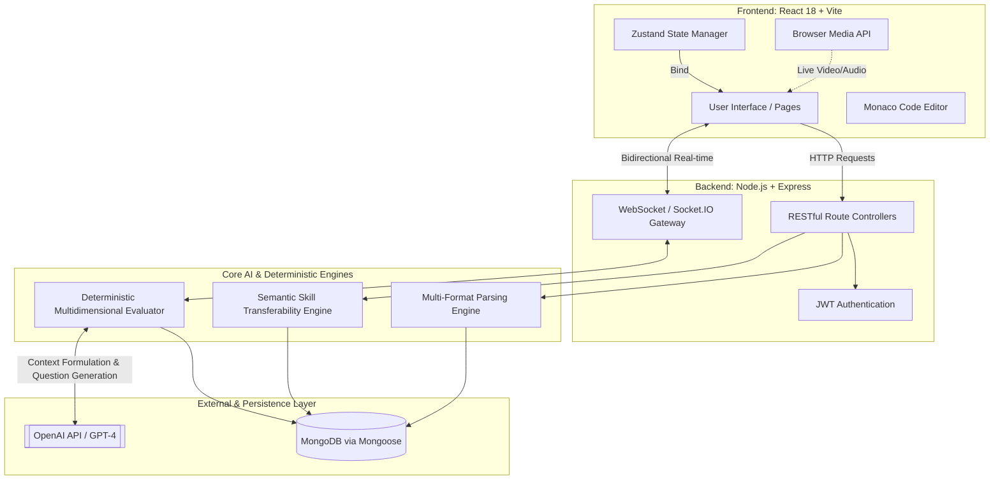
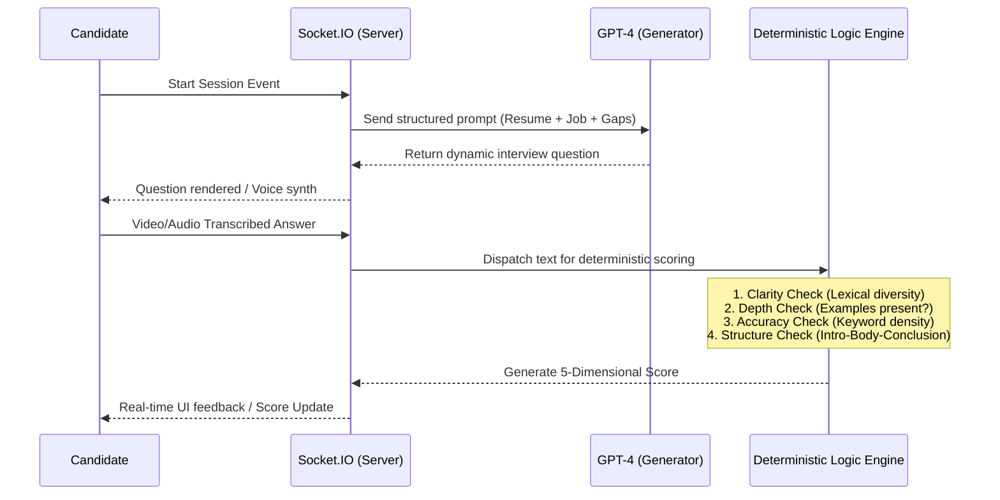
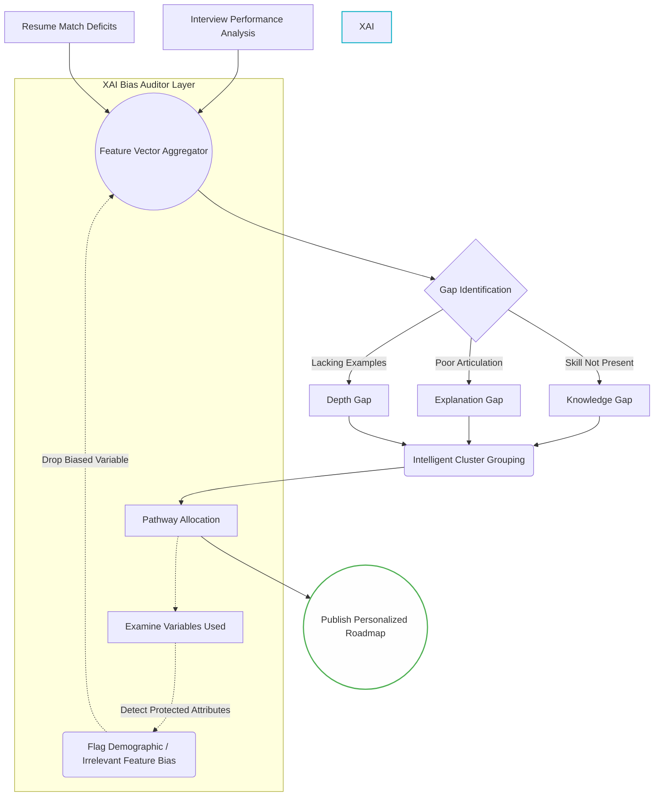

# PrepForge: Architectural Models and System Flow Diagrams

This document contains comprehensive structural architectures and working model flowcharts for PrepForge. These diagrams have been mapped precisely to align with the core research principles discussed in the **Explainable and Fair AI in Recruitment** Literature Survey (`RESEARCH_PAPER.md`).

They provide a visual, professional, and academic explanation of the internal pipelines that make the platform transparent, highly performant, and fair to candidates.

---

## 1. High-Level Macro System Architecture
This structural diagram illustrates the comprehensive technology stack serving client requests, managing state, handling real-time multimedia connections, and interacting with foundation LLM endpoints. 

### Explanation:
The macroscopic view exhibits a clear separation of concerns (SoC). Real-time dependencies (like Live Code Evaluation and Conversational Interviews) strictly utilize the WebSocket Gateway, avoiding REST latency. The core AI modules execute exclusively on the backend to prevent malicious client mutations. The deterministic evaluator (the scoring framework) wraps around the LLM, meaning the AI only *generates* language, but the system's deterministic logic *grades* the language, preventing LLM "black-box" grading biases.

---

## 2. Explainable NLP Resume Pipeline (Smart-Hiring Flow)
To understand how the system extracts candidate features intelligently while avoiding keyword-stuffing limitations, we map out the NLP Pipeline. This mirrors the "Smart-Hiring" capabilities denoted in architectural research.

```mermaid
flowchart LR
    Upload[Upload Resume PDF/Docx] --> Parser(Document Parsing Module)
    Parser --> Structure{Format Heuristic Detector}
    Structure -->|Western Format| Extract1[Extract Standard Layout]
    Structure -->|Europass Format| Extract2[Extract Dual-Column]
    Structure -->|Indian Format| Extract3[Extract Data-Heavy]
    
    Extract1 & Extract2 & Extract3 --> NER(Named Entity Recognition)
    NER --> Ontology[(Skill Ontology Database)]
    
    Ontology --> ContextExtract(Extract Proficiency & Experience Context)
    ContextExtract --> GenProfile[Generate Structured Candidate Profile]
    
    GenProfile --> Demand{Compare vs Job Demand}
    Demand -->|TF-IDF / Semantic Proximity| Score[Calculate Proximity Score]
    
    Score --> Output[Output: Explainable Candidate Match Score]
    
    style Output fill:#fefefe,stroke:#333,stroke-width:2px
```

### Explanation:
Traditional Parsers fail if a candidate uploads an unconventional resume (rigid boundaries). PrepForge utilizes a Structure Heuristic Detector to ascertain document geography dynamically. Following extraction, the NER engine maps text strings to the **Skill Ontology Database** (e.g., mapping "ReactJS" to "React"). Instead of simple presence verification, the Pipeline extracts syntactic context around the entity (e.g., isolating the phrase "5+ years of" leading up to "Python") to deduce empirical experience depth efficiently.

---

## 3. Conversational AI Interview Interaction Loop
This diagram showcases how the real-time interaction flows between candidate input, prompting engineering via LLM, and transparent mathematical scoring.

### Explanation:
The Conversational Pipeline explicitly demonstrates accountability. Highlighting interactions between the Socket Server and LLM shows that LLM generation executes synchronously before the query arrives to the client. The most important characteristic here is the **Deterministic Logic Engine**. When a candidate answers, the LLM is bypassed. The response is graded algorithmically via transparent checks (lexical diversity, expected semantic overlap density), assuring extreme reproducibility in case an auditor or regulator wishes to verify why a candidate failed.

---

## 4. Skill Gap Cluster & Bias Mitigation Feed Architecture
This diagram outlines how discrepancies are converted into actionable learning pathways. Additionally, it highlights where XAI principles execute logically as a bias supervision layer.

### Explanation:
A primary issue in skill progression is overwhelming candidates. If a candidate is missing React, Next.js, and Redux, traditional engines display three severe penalties. PrepForge's **Intelligent Cluster Grouping** recognizes that these are node children of the React Ecosystem and produces ONE "Pathway Allocation," streamlining cognitive load. 
Crucially, the theoretical **XAI Bias Auditor Layer** sits atop this. It examines what variables fueled the gaps (e.g., if Name, Gender, or geographic zip proxy data skewed the generation) and prunes them from the Feature Vector Aggregator to ensure demographic parity and unwavering fairness.
